# VLM Council Debate Evaluation Report

- **Country accuracy:** 63.0% (n = 500)
- **Haversine error:** median 435 km, mean 1,571 km
- **Judge synthesis quality:** 0.656 mean (0.500 median)
- **Debate rate:** 17.4%

## 1. Ground-Truth Statistics

### Headline Metrics

| Metric | Value |
|--------|-------|
| Country accuracy | 63.0% |
| Median haversine | 435 km |
| Mean haversine | 1,571 km |
| N images | 500 |

### Geographic Bias

- North bias: Significant north bias (p=0.0003, mean=+1.93°)
- East bias:  No significant bias (p=0.7061, mean=-0.64°)

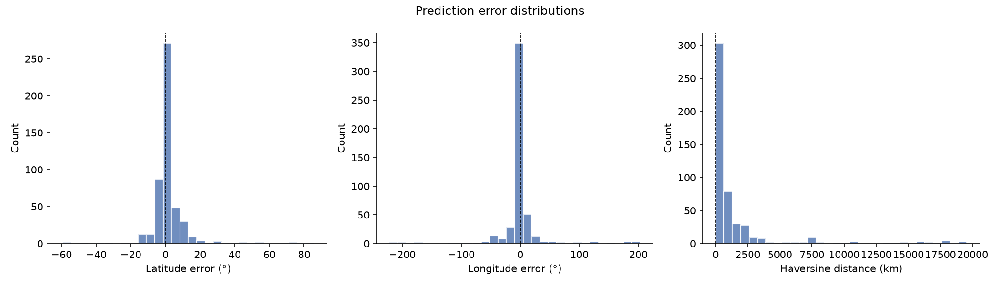
_Lat/lng/haversine error distributions_

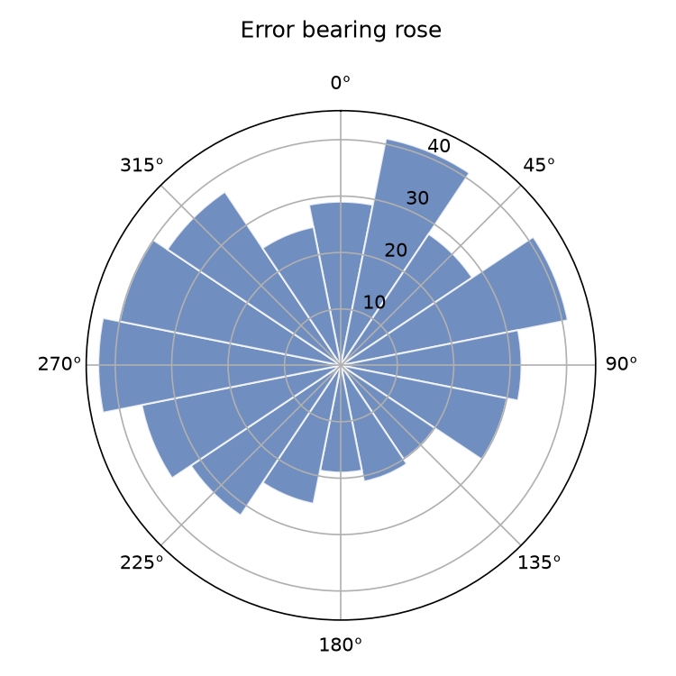
_Direction of prediction errors_

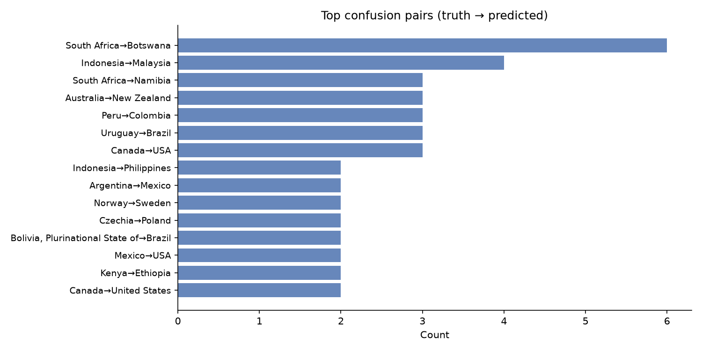
_Top confusion pairs (truth → predicted)_

### Per-agent Accuracy (Initial Round)

| Agent | Top-1 | Top-3 | Coverage | n |
|-------|-------|-------|----------|---|
| linguistic | 16.8% | 18.2% | 21.2% | 500 |
| landscape | 63.2% | 79.4% | 100.0% | 500 |
| botanics | 62.8% | 77.0% | 99.2% | 500 |
| regulatory | 55.8% | 68.4% | 88.0% | 500 |
| meta | 62.2% | 73.0% | 92.8% | 500 |

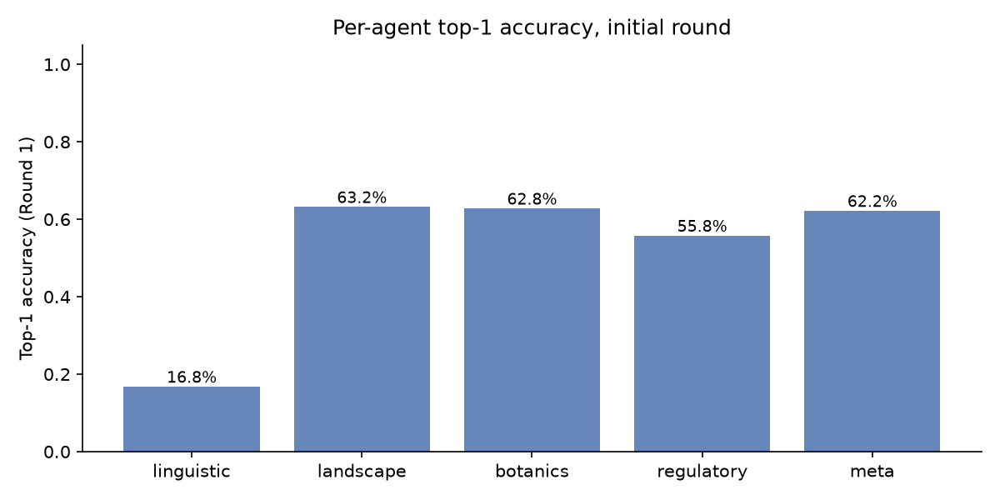
_Per-agent top-1 accuracy_

### Geographic World Maps

Per-country accuracy across 91 countries with truth. Macro-averaged TPR: **51.3%**.

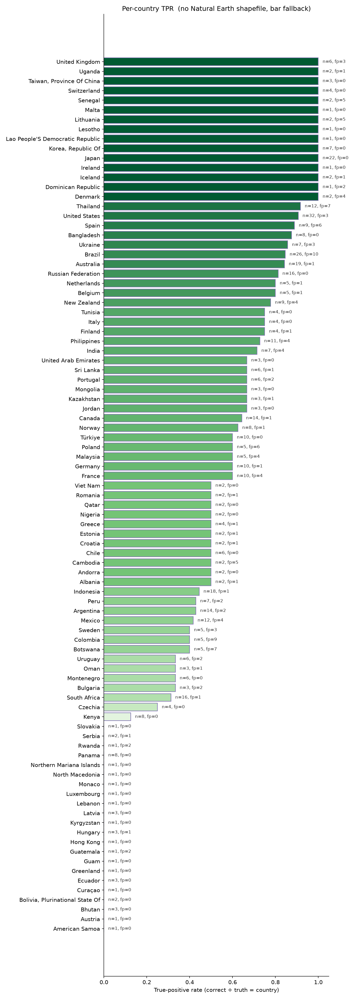
_Per-country true-positive rate (green) with false-positive outlines (red)._

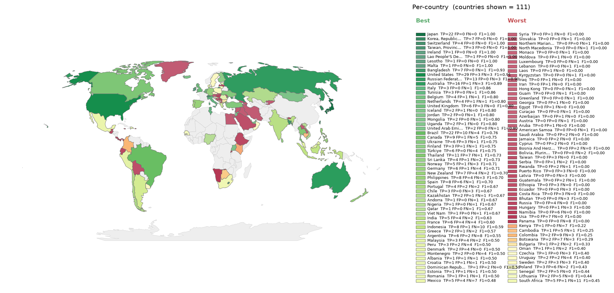
_Per-country F1, divergent around the run's macro-F1. Green = above average, red = below._

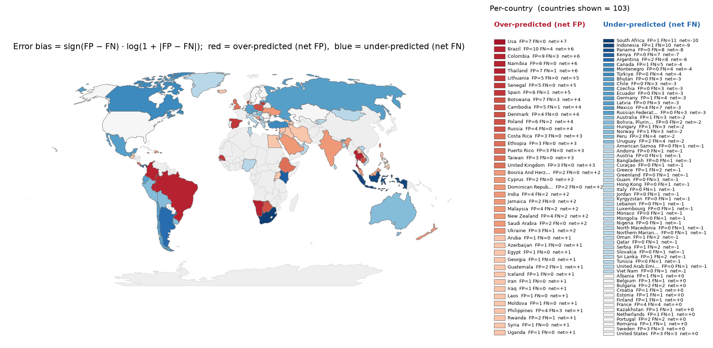
_Per-country error bias (FP-FN)/(FP+FN). Red = over-predicted, blue = missed._

## 2. Approach Dynamics

### Debate Activation

- Images with no debate: **413** (82.6%)
- Images with ≥1 debate round: **87** (17.4%)
- Mean exchanges per pairing: **3.31**

**Debate rounds distribution:**

| Rounds | Count |
|--------|-------|
| 0 | 413 |
| 1 | 66 |
| 2 | 16 |
| 3 | 5 |

**Termination reasons:**

| Reason | Count |
|--------|-------|
| consensus | 442 |
| weak_dissent | 24 |
| stalemate | 15 |
| max_rounds_reached | 5 |
| other | 13 |

### Debate Participation

| Agent | Debated | Revised | Won | Correct side | Rev. rate |
|-------|---------|---------|-----|--------------|-----------|
| linguistic | 13 | 9 | 4 | 2 | 69.2% |
| landscape | 66 | 44 | 15 | 17 | 66.7% |
| botanics | 66 | 35 | 16 | 17 | 53.0% |
| regulatory | 118 | 19 | 80 | 39 | 16.1% |
| meta | 39 | 20 | 12 | 14 | 51.3% |

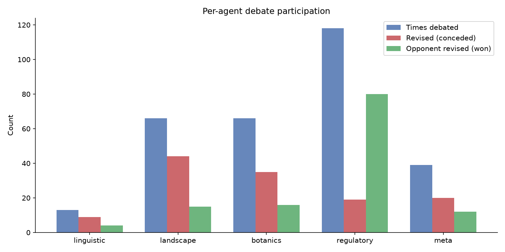
_Per-agent debate participation_

### Convergence & Ground-Truth Effect

- Debating agents converged to one position: **66/87** (75.9%)
- Still disagreed after debate: **21**
- Final result matches Round-1 majority: **345/500** (69.0%)

**Ground-truth pairing classification** (n = 151 debated pairings):

| Category | Count | Share |
|----------|-------|-------|
| Constructive (truth-bearer convinced the wrong agent) | 37 | 24.5% |
| Destructive (truth-bearer abandoned the truth) | 37 | 24.5% |
| Stand-correct (truth-bearer held the line) | 15 | 9.9% |
| Both wrong (no truth-bearer in pairing) | 62 | 41.1% |

## 3. LLM-as-Judge Verdicts

Verdicts: 500/500

### Per-agent Scores

| Agent | Role adh. | Hall. ↓ | Arg. qual. ↑ | Rev. just. ↑ | Debate contrib. ↑ |
|-------|-----------|---------|-------------|-------------|-------------------|
| linguistic | 98.6% | 0.004 | 0.654 | 0.808 | 0.538 |
| landscape | 100.0% | 0.037 | 0.750 | 0.828 | 0.623 |
| botanics | 100.0% | 0.037 | 0.689 | 0.731 | 0.561 |
| regulatory | 100.0% | 0.021 | 0.779 | 0.787 | 0.640 |
| meta | 100.0% | 0.021 | 0.707 | 0.743 | 0.593 |

### System-level Scores

| Metric | Mean | Median | n |
|--------|------|--------|---|
| Moderator pairing quality | 0.768 | 1.000 | 500 |
| Judge synthesis quality | 0.656 | 0.500 | 500 |

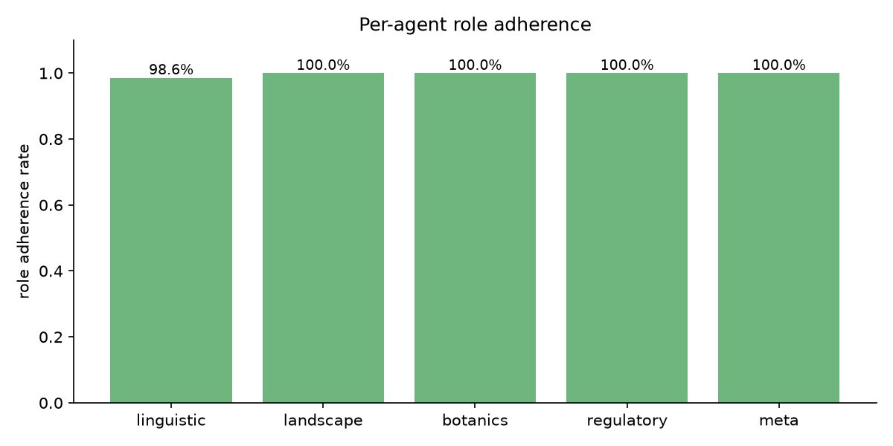
_Role adherence per agent_

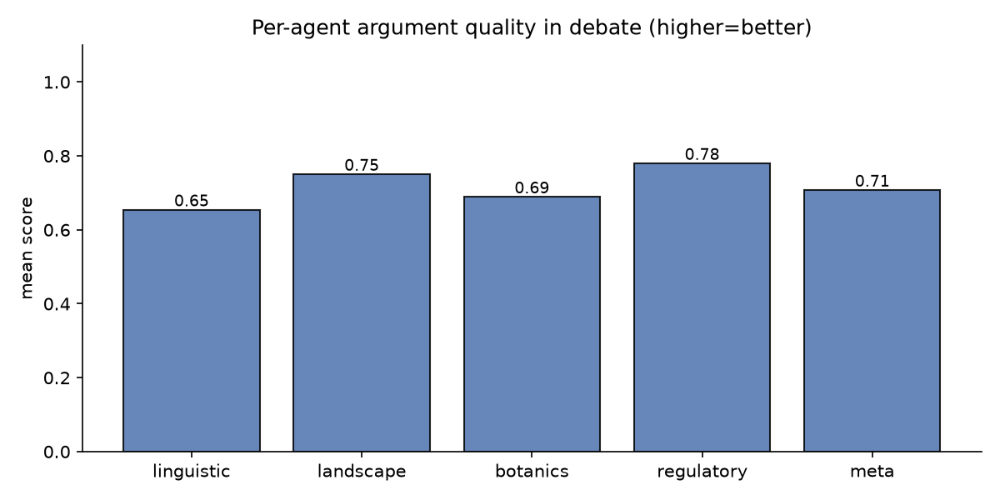
_Argument quality per agent_

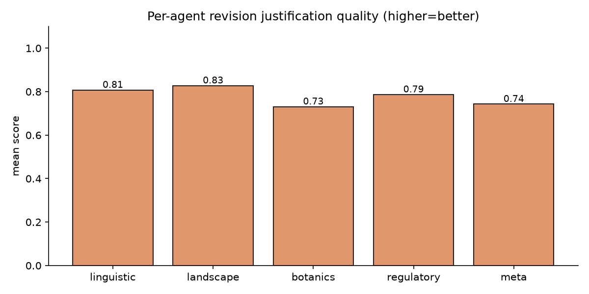
_Revision justification per agent_

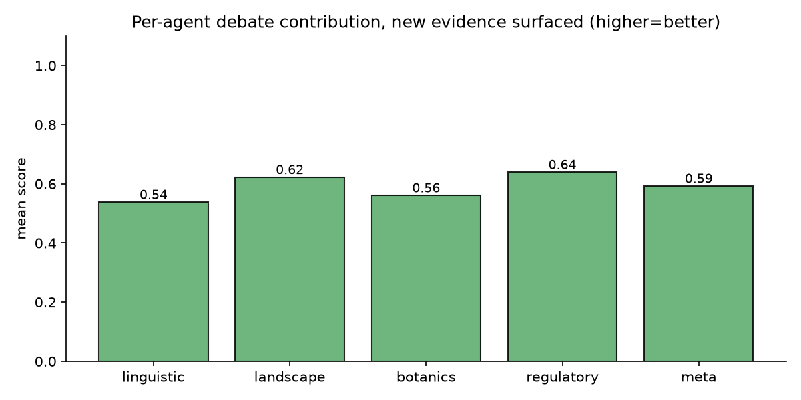
_Debate contribution per agent_

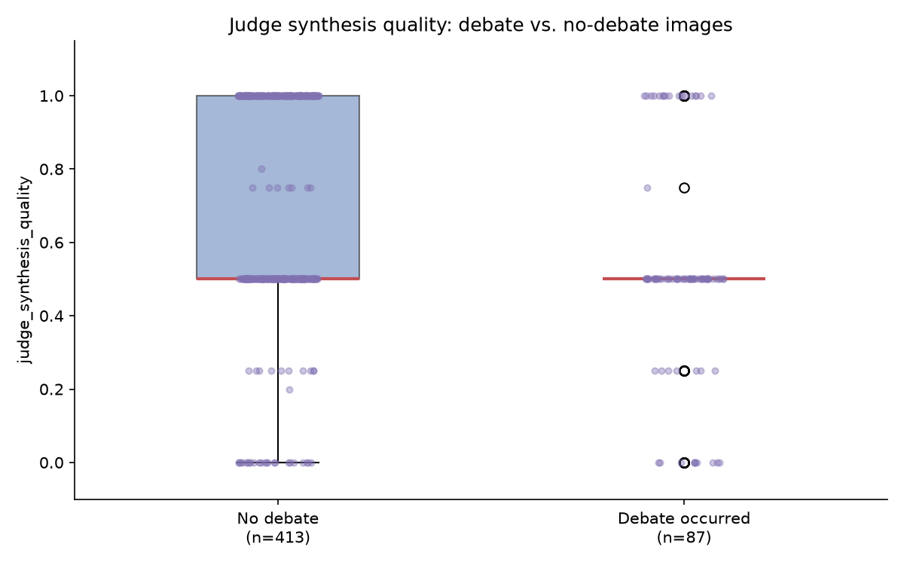
_Judge synthesis quality: debate vs. no-debate_

### Hallucination Examples

**linguistic:**

| Image | Score | Claim |
|-------|-------|-------|
| HF1MKwIFNCNb4FdM_3 | 0.800 | The text 'Vilabonita' on the billboard is a specific residential project name located in Colombia. |
| HF1MKwIFNCNb4FdM_3 | 0.800 | Elegi confort y calidad de vida a solo 10 minutos de... Vilabonita |
| IozkbMt8zbdH9XCv_5 | 0.000 | The use of English in this specific institutional format is extremely common in India |
| IozkbMt8zbdH9XCv_5 | 0.000 | The term 'College of Engineering' is a standard naming convention for Indian technical instit |
| Y2QhKx7sks9MExvw_1 | 0.200 | The wording on the yellow sign is in Italian |

**landscape:**

| Image | Score | Claim |
|-------|-------|-------|
| 4UvmdTHySo6AXW4M_5 | 0.500 | The vegetation and crop patterns are consistent with the Indo-Gangetic Plain. |
| 6fGwHxCTvCbaK77Q_4 | 0.250 | The combination of volcanic-looking slopes... is highly characteristic of the Azores archipelago. |
| 74bPHM081cMUaNKT_4 | 0.200 | The vegetation is consistent with tropical montane forests/shrublands found in the A [...] |
| 74bPHM081cMUaNKT_5 | 0.250 | The soil is dry and light-colored, consistent with the coastal or lowland regions of the Adriatic coast. |
| DKGAIVKGYnLWmMy9_5 | 0.200 | The road infrastructure is highly characteristic of rural Romania. |

**botanics:**

| Image | Score | Claim |
|-------|-------|-------|
| 3OuVMcpGjmm0tVfG_5 | 0.500 | The combination of Washingtonia robusta (Mexican Fan Palm) and the arid-zone scrub vegetation is highly characteristic of Northern and Central Mexico. |
| 4UvmdTHySo6AXW4M_5 | 0.500 | The combination of a young cereal crop (likely wheat) and the specific scrubby, thorny hedge vegetation is common in the Indo-Gangetic plains. |
| 6fGwHxCTvCbaK77Q_4 | 0.250 | The combination of Cupressus macrocarpa (Monterey Cypress) hedges and Pinus radiata plantations on steep slopes is extremely characteristic of the Azores islands. |
| 74bPHM081cMUaNKT_2 | 0.250 | The vegetation consists of extremely sparse, xeric bunchgrasses and a near-total absence of the succulent diversity (such as Aizoaceae or Euphorbia) typically found in the South African Karoo. |
| 74bPHM081cMUaNKT_4 | 0.200 | The vegetation consists of dry savanna scrub and scattered broadleaf trees consistent with the Kenyan highlands or rift valley regions. |

**regulatory:**

| Image | Score | Claim |
|-------|-------|-------|
| 1NJsXTxIF9GGMDxC_1 | 0.500 | The green fuel price totem displays 'A3C', which is a common designation for fuel types in Azerbaijan. |
| 3uP6lYo9pzx5Q0km_3 | 0.500 | The white roadside delineator posts with a red reflector on the right side and a black reflector on the left are highly characteristic of Polish road standards. |
| 6fGwHxCTvCbaK77Q_4 | 0.250 | The specific construction of the wooden fence posts on the left—specifically the height, spacing, and the way they are driven into the soft verge—is a standard rural [NZ] boundary. |
| 74bPHM081cMUaNKT_4 | 0.200 | The combination of a single yellow center line and white edge lines on a rural paved road is highly characteristic of Ethiopia. |
| 74bPHM081cMUaNKT_5 | 0.250 | The combination of concrete building styles, specific utility pole designs, and the general road quality is highly characteristic of urban outskirts in Albania. |

**meta:**

| Image | Score | Claim |
|-------|-------|-------|
| 1NJsXTxIF9GGMDxC_1 | 0.500 | The green fuel price totem is characteristic of SOCAR (State Oil Company of Azerbaijan Republic) stations. |
| 3I4ZtihbhZy5qZzQ_5 | 0.000 | The combination of the specific white small truck (likely a Suzuki Carry or similar kei-style truck) and the prevalence of Mitsubishi pickups is very common in Thailand. |
| 3I4ZtihbhZy5qZzQ_5 | 0.000 | The style of the concrete perimeter walls topped with chain-link fencing and barbed wire is a frequent sight in Thailand. |
| 3I4ZtihbhZy5qZzQ_5 | 0.000 | The use of small utility trucks and the specific style of the blue metal gate and corrugated roofing are common in the Philippines. |
| 3uP6lYo9pzx5Q0km_3 | 0.500 | The delineator posts are white with a small rectangular reflector (red on the right, white/black on the left) and a distinct black band near the bottom, which is a highly specific meta for Poland. |
