# VLM Council Global Context Reguess Evaluation Report

- **Images evaluated:** 500
- **Country accuracy:** 65.0%
- **Haversine error:** mean 1,546 km, median 410 km, p90 3,109 km
- **Mean round2 improvement (judge):** 0.509
- **Judge synthesis quality:** mean 0.683 (median 0.750, n=500)

## 1. Ground-Truth Statistics

### Headline Metrics

| Metric | Value |
|---|---|
| Country accuracy | 65.0% |
| Median haversine | 410 km |
| Mean haversine | 1,546 km |
| N images | 500 |

### Geo-spatial Bias

- North/south bias: strong north bias (p=0.0001)
- East/west bias: no significant bias (p=0.9309)
- Error quadrants: NE=138, NW=137, SE=100, SW=125
- Mean absolute lat error: 5.48 deg, mean absolute lng error: 13.31 deg

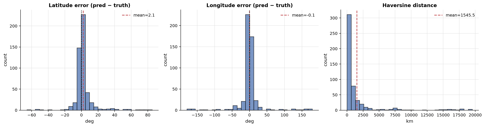

_Figure 1: Latitude and longitude error and haversine distribution._

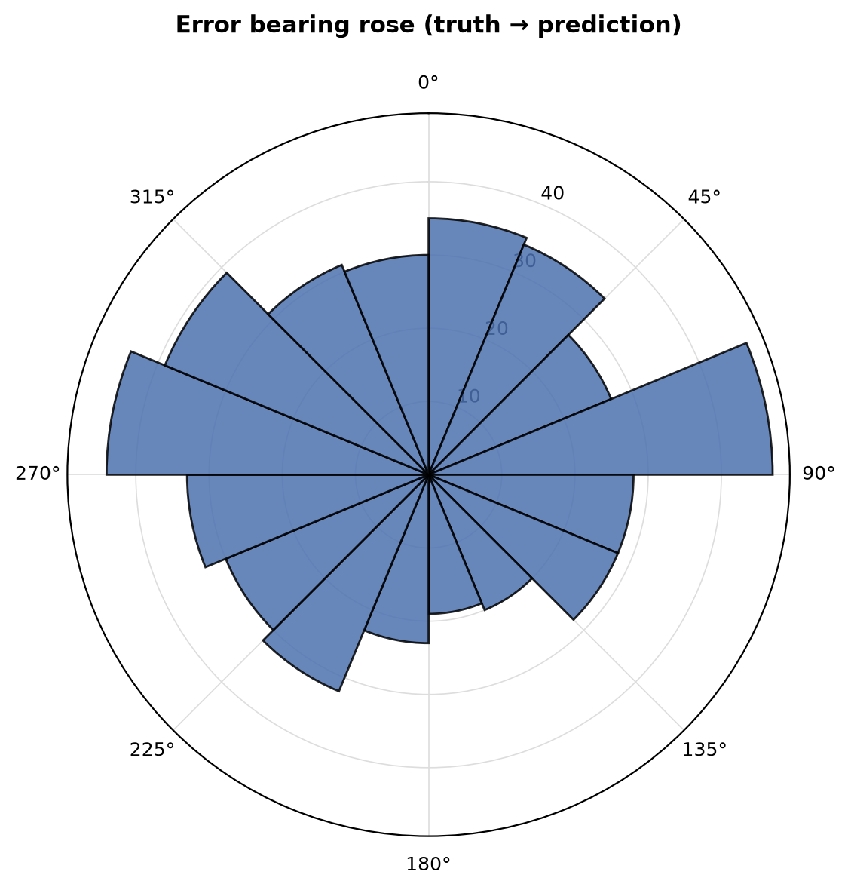

_Figure 2: Bearing of prediction errors (truth to prediction)._

### Top Confusion Pairs

| Truth | Predicted | Count |
|---|---|---|
| canada | united states | 5 |
| south africa | botswana | 4 |
| argentina | mexico | 3 |
| south africa | namibia | 3 |
| panama | puerto rico | 3 |
| peru | colombia | 3 |
| uruguay | brazil | 3 |
| indonesia | philippines | 2 |
| czechia | poland | 2 |
| montenegro | georgia | 2 |
| poland | lithuania | 2 |
| bulgaria | moldova | 2 |
| bolivia | brazil | 2 |
| kenya | ethiopia | 2 |
| germany | poland | 2 |

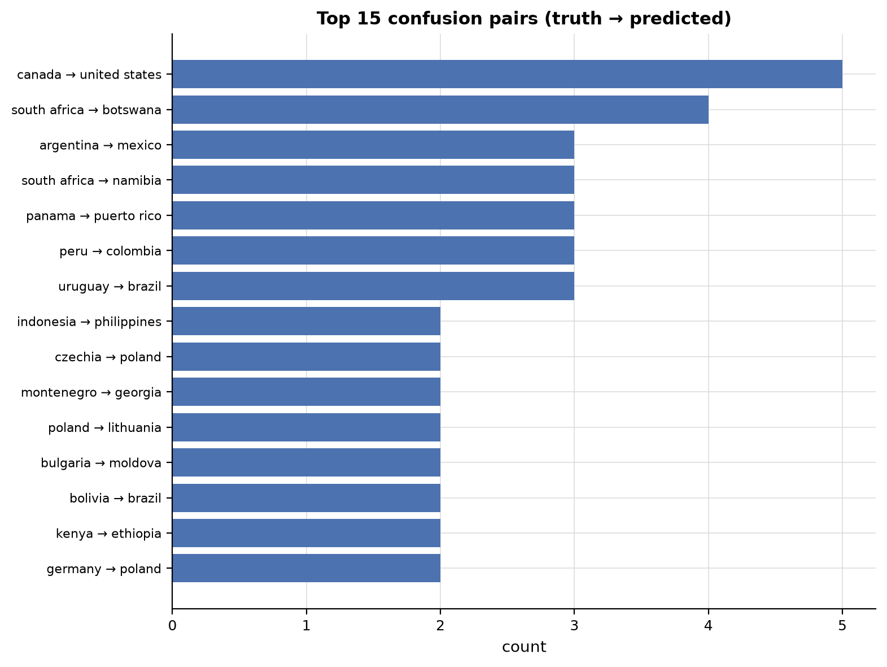

_Figure 3: Top 15 confusion pairs (truth to predicted)._

### Per-agent Ground-Truth Accuracy (Round 1)

| Agent | n | Top-1 | Top-3 | Coverage |
|---|---|---|---|---|
| linguistic | 107 | 79.4% | 86.0% | 90.7% |
| landscape | 500 | 63.4% | 80.0% | 82.0% |
| botanics | 499 | 63.7% | 79.4% | 80.2% |
| regulatory | 443 | 64.3% | 77.7% | 78.6% |
| meta | 499 | 62.5% | 75.2% | 75.2% |

### Per-agent Ground-Truth Accuracy (Round 2)

| Agent | n | Top-1 | Top-3 | Coverage |
|---|---|---|---|---|
| linguistic | 134 | 82.8% | 91.0% | 91.8% |
| landscape | 500 | 65.0% | 80.2% | 82.4% |
| botanics | 500 | 64.6% | 81.0% | 82.0% |
| regulatory | 500 | 64.6% | 80.6% | 82.4% |
| meta | 500 | 64.6% | 79.0% | 79.8% |

### Geographic World Maps

Per-country accuracy across 91 countries with truth. Macro-averaged TPR: **53.1%**.

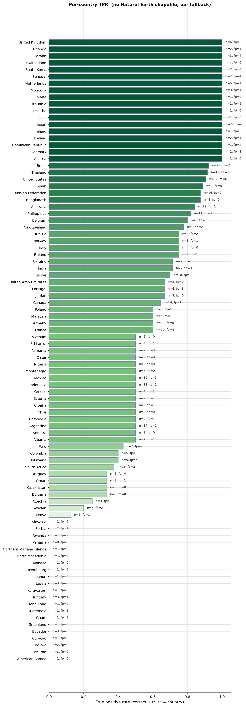
_Per-country true-positive rate (green) with false-positive outlines (red)._

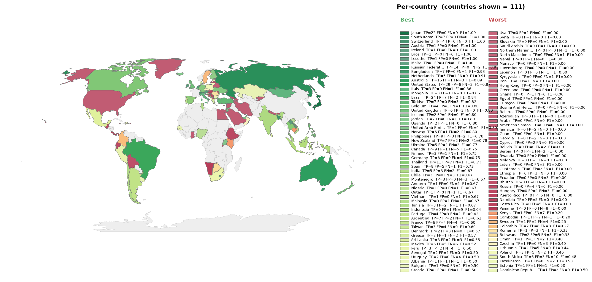
_Per-country F1, divergent around the run's macro-F1. Green above average, red below._

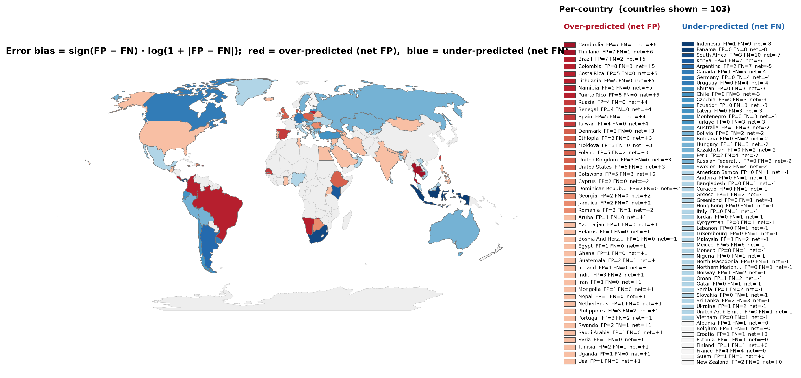
_Per-country error bias (FP-FN)/(FP+FN). Red over-predicted, blue missed._

## 2. Approach Dynamics

Each image runs Round 1 (independent per-agent guesses) then Round 2 (each agent re-guesses with the full set of Round 1 assessments as global context). The dynamics below track how that context shifted agents between the two rounds and whether those shifts moved the council toward or away from the ground truth.

### Agent Round Comparison

Per-agent top-1 accuracy in Round 1 vs Round 2. Change rate is the fraction of images where the top-1 country changed. Confidence shift is the fraction where Round 2 confidence was higher than Round 1.

| Agent | R1 Top-1 | R2 Top-1 | Change rate | Conf. shift |
|---|---|---|---|---|
| linguistic | 79.4% | 82.8% | 10.3% | 17.8% |
| landscape | 63.4% | 65.0% | 8.8% | 16.2% |
| botanics | 63.7% | 64.6% | 11.6% | 40.3% |
| regulatory | 64.3% | 64.6% | 15.6% | 52.4% |
| meta | 62.5% | 64.6% | 9.4% | 30.9% |

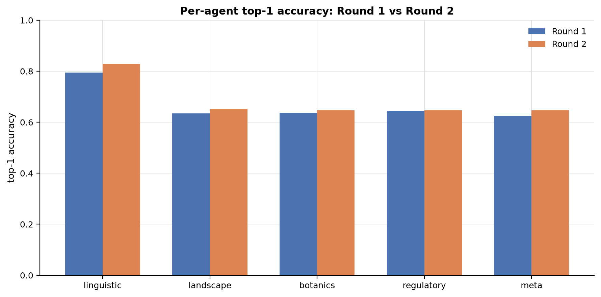

_Figure 4: Per-agent top-1 accuracy: Round 1 vs Round 2._

### Round 1 to Round 2 Movement

| Metric | Value |
|---|---|
| Comparable agent-image pairs | 2048 |
| Top pick changed in R2 | 229 (11.2%) |
| Top pick unchanged in R2 | 1819 |
| Confidence up in R2 | 687 |
| Confidence down in R2 | 2 |

### Agreement Dynamics (R1 plurality vs R2 plurality)

| Transition | Count |
|---|---|
| R1 unanimous (5/5 same country) | 84 |
| R2 unanimous (5/5 same country) | 124 |
| R1 split to R2 unanimous (context built consensus) | 40 |
| R1 unanimous to R2 split (context broke consensus) | 0 |
| R1 sub-plurality to R2 plurality (context built majority) | 64 |
| R1 plurality to R2 sub-plurality (context broke majority) | 2 |
| Same plurality top country in both rounds | 468 |

### Constructive vs Destructive R1 to R2 Shifts

Classification of each comparable agent-image pair (n = 2048 pairs with ground truth).

| Category | Count | Share |
|---|---|---|
| Constructive (R1 wrong, R2 corrected onto GT) | 64 | 3.1% |
| Destructive (R1 correct, R2 moved away from GT) | 26 | 1.3% |
| Stayed correct (both rounds on GT) | 1291 | 63.0% |
| Stayed wrong (both rounds on the same wrong country) | 528 | 25.8% |
| Lateral (both rounds wrong, different countries) | 139 | 6.8% |

Among the 90 pairs where exactly one round had the GT: constructive 64/90 (71.1%), destructive 26/90 (28.9%).

### Per-agent R1 to R2 Shift Matrix

Net truth is constructive minus destructive shifts. Positive means context pulled the agent toward the ground truth; negative means away.

| Agent | n | Constr | Destr | StayOK | StayX | Lateral | Net truth | R1 acc | R2 acc | Delta |
|---|---|---|---|---|---|---|---|---|---|---|
| linguistic | 107 | 5 | 1 | 84 | 12 | 5 | +4 | 79.4% | 83.2% | 3.7% |
| landscape | 500 | 14 | 6 | 311 | 145 | 24 | +8 | 63.4% | 65.0% | 1.6% |
| botanics | 499 | 10 | 6 | 312 | 129 | 42 | +4 | 63.7% | 64.5% | 0.8% |
| regulatory | 443 | 20 | 9 | 276 | 98 | 40 | +11 | 64.3% | 66.8% | 2.5% |
| meta | 499 | 15 | 4 | 308 | 144 | 28 | +11 | 62.5% | 64.7% | 2.2% |

### Round 2 Convergence (per image, plurality at least 3/5)

| Outcome | Count | Share |
|---|---|---|
| Plurality on GT (correct) | 317 | 63.4% |
| Plurality on wrong country | 166 | 33.2% |
| No plurality (top at most 2/5) | 17 | 3.4% |

## 3. LLM-as-Judge Verdicts

- Verdicts: 500 / 500
- Mean round2 improvement: **0.509** (1=genuine synthesis, 0=rubber-stamp)

### Per-agent Quantitative Scores

| Agent | n | Role adher. | Hallucination low is better | Visual cons. high is better | Calibration high is better | R2 improvement high is better |
|---|---|---|---|---|---|---|
| linguistic | 500 | 97.0% | 0.00 | 1.00 | 0.77 | 0.23 |
| landscape | 500 | 100.0% | 0.03 | 0.96 | 0.74 | 0.57 |
| botanics | 500 | 100.0% | 0.04 | 0.95 | 0.74 | 0.58 |
| regulatory | 500 | 100.0% | 0.02 | 0.97 | 0.74 | 0.58 |
| meta | 500 | 100.0% | 0.03 | 0.97 | 0.74 | 0.58 |

### Judge Synthesis Quality (n=500)

Mean: **0.683**, median: 0.750, stdev: 0.318

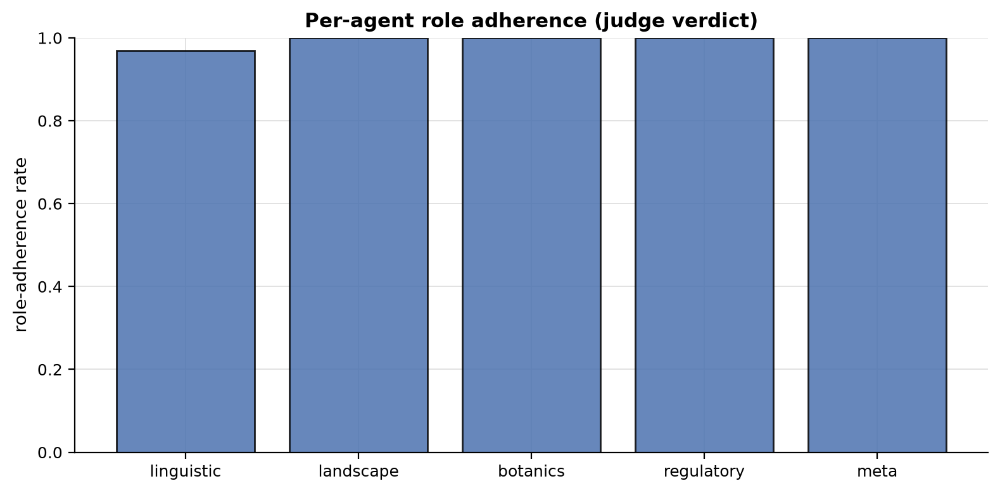

_Figure 5: Per-agent role adherence rate._

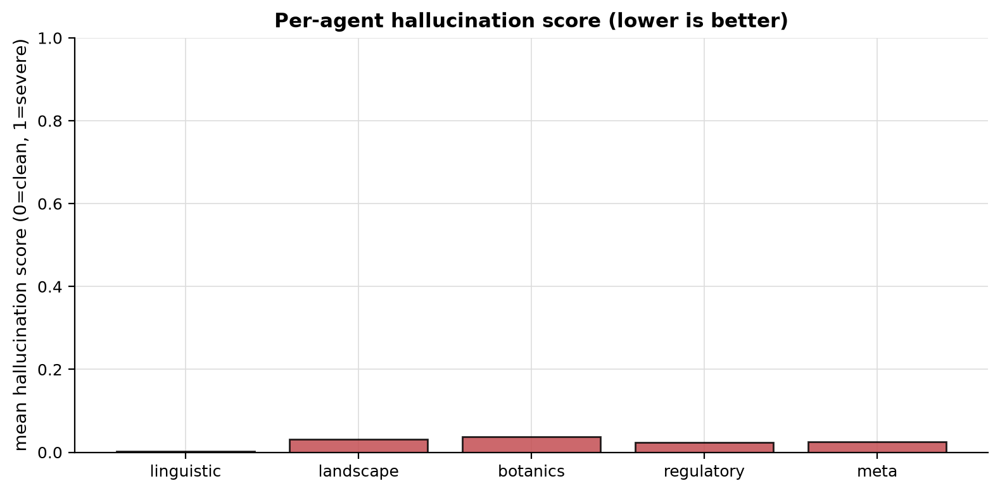

_Figure 6: Per-agent mean hallucination score (0 clean, 1 severe)._

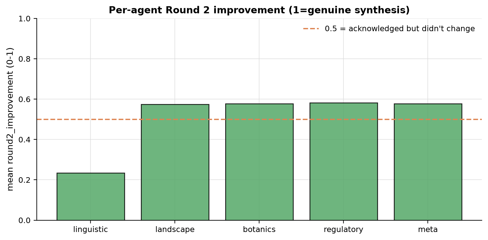

_Figure 7: Per-agent mean Round 2 improvement score (reference line at 0.5)._

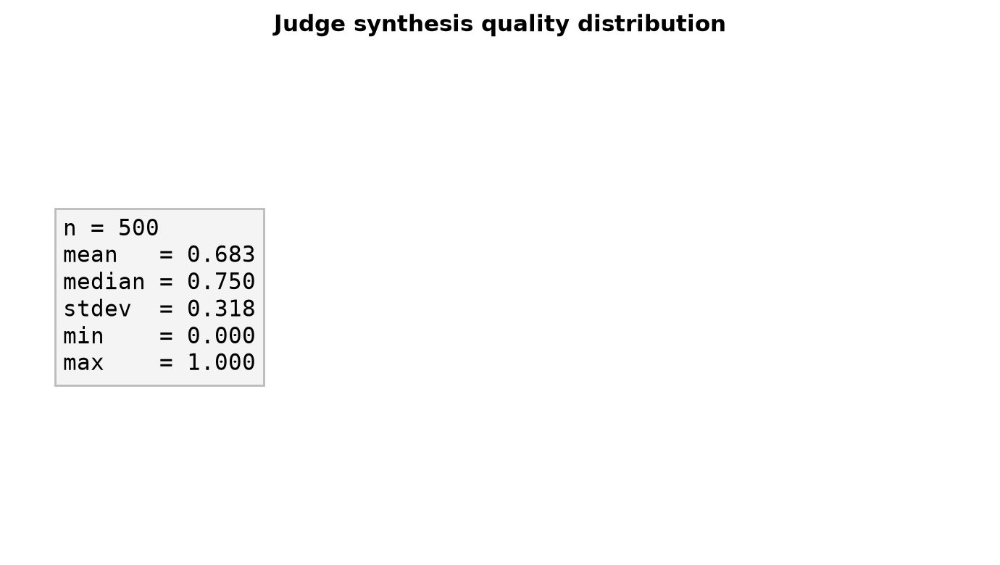

_Figure 8: Judge synthesis quality distribution._

### Hallucination Examples

Concrete claims flagged by the judge as not supported by the image. Up to 10 examples per agent.

**linguistic:**

| Image | Score | Hallucinated claim |
|---|---|---|
| HF1MKwIFNCNb4FdM_3 | 1.00 | The text 'Vilabonita' on the billboard is a specific real estate development located in Colombia. |
| HF1MKwIFNCNb4FdM_3 | 1.00 | The text 'Vilabonita' refers to a specific real estate development in Colombia. |
| IozkbMt8zbdH9XCv_5 | 0.00 | the Meta Agent's identification of the red car roof as a specific Google Street View signature for Ghana is a critical technical clue. |
| oIqmyQzBGtaIeI84_4 | 0.50 | The text 'SOLGAS' refers to a gas distribution company that operates primarily in Colombia. |

**landscape:**

| Image | Score | Hallucinated claim |
|---|---|---|
| 3OuVMcpGjmm0tVfG_1 | 0.25 | The specific style of unpaved rural roads and volcanic-looking rock embankments is highly characteristic of the Philippine archipelago. |
| 4UvmdTHySo6AXW4M_3 | 0.25 | The mix of Scots pine and birch trees is highly characteristic of the North European Plain, specifically the sandy soils of Poland. |
| 56Q4T4rpv9O9sCpP_5 | 0.25 | The road quality and marking style are consistent with Botswana's main arterial roads through rural areas. |
| 5GS2RPgTrf85UZM5_3 | 0.25 | The combination of deep red latosol soil, Brachiaria grasses, and tropical scrub is a signature of the Brazilian Cerrado. |
| 67gLC5CcGgkQIWEW_1 | 0.25 | The vegetation and soil appear consistent with the fertile chernozem regions of Eastern Europe. |
| 67gLC5CcGgkQIWEW_5 | 0.25 | The combination of flat terrain, red sandy soil, and the specific mix of coconut palms and banana trees is highly characteristic of rural Cambodia. |
| 6fGwHxCTvCbaK77Q_4 | 0.50 | The specific presence of Cupressus macrocarpa hedges strongly points to the Azores. |
| 74bPHM081cMUaNKT_4 | 0.25 | The vegetation and road infrastructure are nearly identical [to Ecuador] |
| 74bPHM081cMUaNKT_5 | 0.25 | This is strongly reinforced by the Meta Agent's identification of specific Albanian electrical boxes and construction fencing |
| 9lNwy1vjD53PTSwt_1 | 0.25 | The soil appears to be a dark, fertile chernozem typical of this region. |

**botanics:**

| Image | Score | Hallucinated claim |
|---|---|---|
| 3OuVMcpGjmm0tVfG_1 | 0.25 | The combination of Musa (banana) and Manihot esculenta (cassava) in a small-scale home garden setting is extremely common in rural Philippines. |
| 3uP6lYo9pzx5Q0km_5 | 0.50 | The dense, mixed broadleaf forest featuring species consistent with Colchic rainforests (such as Castanea sativa and various Fagus species) |
| 3uP6lYo9pzx5Q0km_5 | 0.50 | Fagus sylvatica (European Beech) |
| 3uP6lYo9pzx5Q0km_5 | 0.50 | Castanea sativa (Sweet Chestnut) |
| 4UvmdTHySo6AXW4M_3 | 0.25 | The combination of Pinus sylvestris (Scots Pine) and Betula pendula (Silver Birch) is highly characteristic of the lowland mixed forests of Central Europe, particularly Poland. |
| 4UvmdTHySo6AXW4M_5 | 0.50 | The combination of a lush green winter cereal crop (likely wheat) and the specific structure of the scrubby, thorny hedgerows is very common in the Indo-Gangetic plains. |
| 4UvmdTHySo6AXW4M_5 | 0.50 | The agricultural landscape, specifically the winter wheat cultivation and the arid soil of the dirt road, is nearly identical to that of Northern India. |
| 56Q4T4rpv9O9sCpP_5 | 0.25 | The vegetation density and flat terrain are highly characteristic of the Botswana interior Kalahari basin. |
| 5GS2RPgTrf85UZM5_3 | 0.25 | The botanical evidence of Brachiaria grasses and Cerrado-style tropical scrub... creates a highly consistent profile for the Brazilian interior. |
| 67gLC5CcGgkQIWEW_1 | 0.25 | The mix of deciduous fruit trees and garden vegetation is highly characteristic of rural residential plots in the Pontic-Caspian steppe and forest-steppe zones. |

**regulatory:**

| Image | Score | Hallucinated claim |
|---|---|---|
| 3OuVMcpGjmm0tVfG_1 | 0.50 | the concrete utility pole design and the specific style of elevated rural housing mentioned by the Meta Agent are consistent with Philippine rural infrastructure. |
| 4UvmdTHySo6AXW4M_3 | 0.25 | rural roads in Poland often have more consistent edge markings than seen here. |
| 56Q4T4rpv9O9sCpP_5 | 0.25 | Namibia typically uses white edge lines more frequently than the distinct yellow edge lines seen here |
| 5bPlIRT7eGN79a2E_3 | 0.00 | The image shows left-hand traffic (LHT) with a yellow center line and white edge lines, which is standard for South African national roads. |
| 6fGwHxCTvCbaK77Q_4 | 0.50 | the concrete utility pole identified by the Meta Agent is highly characteristic of rural Portugal. |
| 74bPHM081cMUaNKT_5 | 0.25 | The specific combination of concrete utility poles, the style of the white electrical box on the sidewalk, and the corrugated metal construction fencing are highly diagnostic of Albanian urban infrastructure |
| EEI3fwu4iZvPT2zP_5 | 0.25 | The specific combination of road quality, utility pole design, and the style of the roadside markers is highly characteristic of rural Lithuania. |
| HF1MKwIFNCNb4FdM_3 | 0.50 | The combination of right-hand traffic, concrete road surfaces with specific expansion joints, and highly diagnostic yellow-painted curbs is a standard in Colombian urban infrastructure. |
| IozkbMt8zbdH9XCv_3 | 0.25 | The blue and white painted curbs are a very common regulatory marking used in Iranian urban areas |
| IozkbMt8zbdH9XCv_5 | 0.00 | The red car roof is a critical meta-signature for Google Street View in Ghana. |

**meta:**

| Image | Score | Hallucinated claim |
|---|---|---|
| 3OuVMcpGjmm0tVfG_1 | 0.50 | The utility pole construction (slender concrete poles with specific cross-arm mounting) and the style of the small, elevated residential structures in the background are highly characteristic of rural Philippines. |
| 4UvmdTHySo6AXW4M_3 | 0.25 | The image quality and slight blur patterns are consistent with Gen 3 Google Street View coverage common in the Baltics. |
| 4UvmdTHySo6AXW4M_5 | 0.25 | The image quality, specifically the high-saturation greens and the distinct 'halo' blur at the bottom of the frame, is highly characteristic of Google's Gen 4 camera used extensively in rural India. |
| 56Q4T4rpv9O9sCpP_5 | 0.50 | The image shows a distinct Google Street View 'halo' or blur at the bottom of the frame, which is characteristic of the Trekker/backpack or specific early car rigs used in Botswana. |
| 5GS2RPgTrf85UZM5_3 | 0.25 | The concrete utility pole with a simple cross-arm is a hallmark of rural Brazilian infrastructure. |
| 67gLC5CcGgkQIWEW_5 | 0.00 | The presence of the distinct Google Street View 'car hood' (the rounded, light-colored protrusion at the bottom) is a strong meta indicator for Cambodia |
| 6fGwHxCTvCbaK77Q_4 | 0.50 | The Gen 3 camera quality and concrete utility pole design strongly align with Portuguese rural infrastructure. |
| 74bPHM081cMUaNKT_5 | 0.25 | The specific design of the white electrical box on the sidewalk is also a strong match for Albanian urban infrastructure. |
| EEI3fwu4iZvPT2zP_5 | 0.25 | The wooden picket fences with brick pillars are very characteristic of rural Lithuanian residential areas, distinguishing it from similar styles in Poland or Latvia. |
| HF1MKwIFNCNb4FdM_3 | 0.50 | The meta evidence of concrete utility poles with specific cross-arms and yellow-painted curbs is strongly reinforced by the linguistic agent's identification of 'Vilabonita'... |
