# VLM Council Hub and Spoke Evaluation Report

- **Country accuracy:** 64.6% (n = 500)
- **Haversine error:** median 435 km, mean 1,598 km
- **Mean discussion rounds:** 1.31
- **Images with discussion:** 389
- **Judge synthesis quality:** 0.623 mean (0.750 median)

## 1. Ground-Truth Statistics

### Headline Metrics

| Metric | Value |
|---|---|
| Country accuracy | 64.6% |
| Median haversine | 435 km |
| Mean haversine | 1,598 km |
| N images | 500 |

### Geographic Bias

- North/south bias: strong north bias (p=0.0005)
- East/west bias: no significant bias (p=0.8940)
- Error quadrants: NE=142, NW=135, SE=107, SW=116

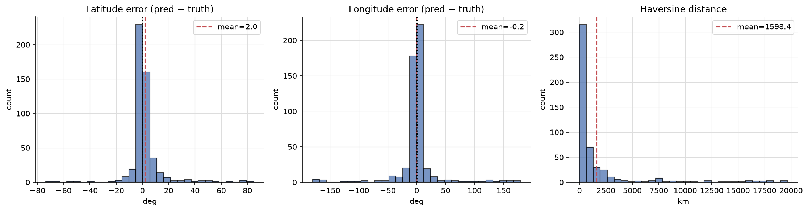
_Lat/lng/haversine error distributions_

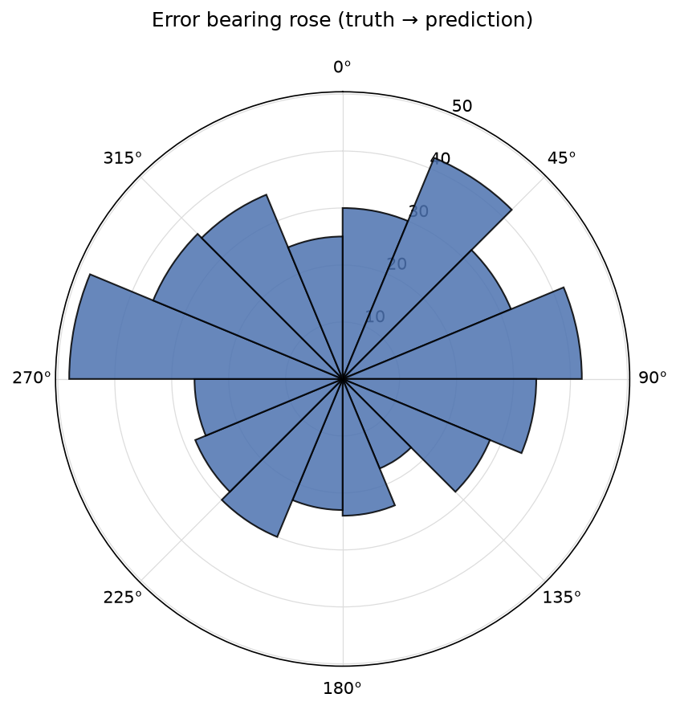
_Direction of prediction errors (truth to prediction)_

### Top Confusion Pairs

| Truth | Predicted | Count |
|---|---|---|
| canada | united states | 5 |
| south africa | botswana | 4 |
| south africa | namibia | 3 |
| australia | new zealand | 3 |
| peru | colombia | 3 |
| uruguay | brazil | 3 |
| indonesia | philippines | 2 |
| argentina | mexico | 2 |
| czechia | poland | 2 |
| poland | lithuania | 2 |
| bolivia | brazil | 2 |
| ukraine | moldova | 2 |
| panama | puerto rico | 2 |
| panama | dominican republic | 2 |
| spain | portugal | 2 |

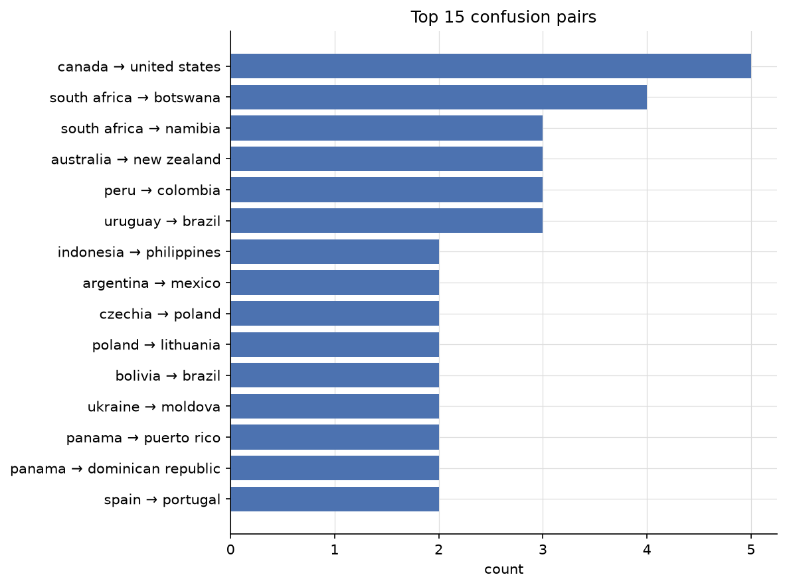
_Top confusion pairs (truth to predicted)_

### Per-agent Accuracy (Initial Round)

| Agent | n | Top-1 | Top-3 | Coverage | Discussion rate | Update rate |
|---|---|---|---|---|---|---|
| linguistic | 107 | 79.4% | 86.0% | 90.7% | 7.0% | 11.4% |
| landscape | 500 | 63.4% | 80.0% | 82.2% | 35.4% | 12.4% |
| botanics | 499 | 63.5% | 79.0% | 79.8% | 16.0% | 18.8% |
| regulatory | 443 | 64.3% | 77.4% | 78.3% | 64.0% | 9.4% |
| meta | 499 | 62.7% | 75.2% | 75.2% | 74.8% | 11.0% |

- **Discussion rate**: fraction of images where this agent was questioned by the judge
- **Update rate**: fraction of times agent changed top-1 country when questioned

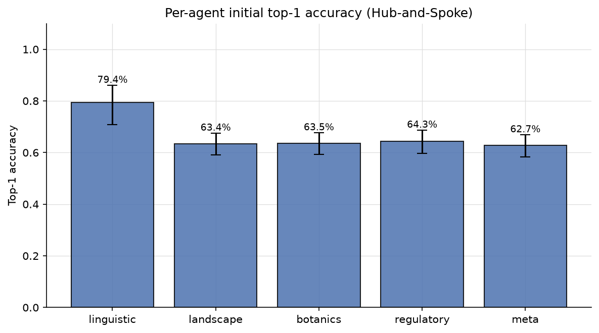
_Per-agent initial top-1 accuracy_

### Geographic World Maps

Per-country accuracy across 91 countries with truth. Macro-averaged TPR: **53.3%**.

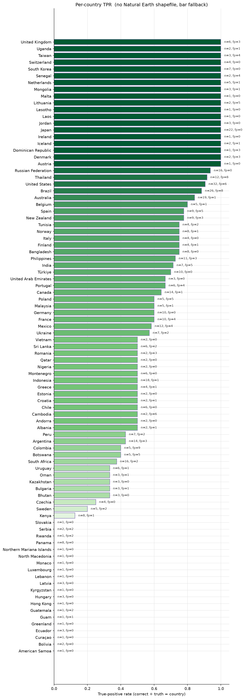
_Per-country true-positive rate (green) with false-positive outlines (red)._

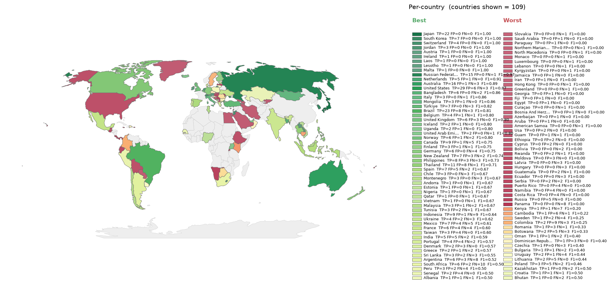
_Per-country F1, divergent around the run's macro-F1. Green = above average, red = below._

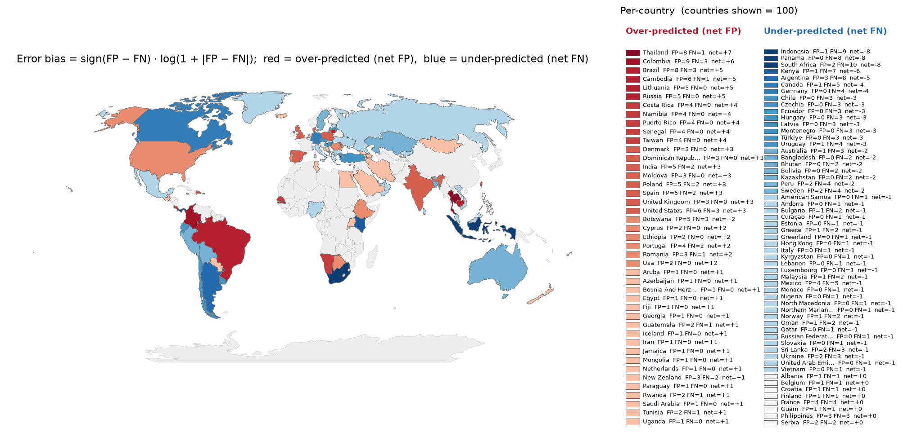
_Per-country error bias (FP-FN)/(FP+FN). Red = over-predicted, blue = missed._

## 2. Approach Dynamics

Hub and spoke topology: five agents give independent assessments, then the judge hub interrogates specific agents with targeted questions over up to three discussion rounds. This section covers discussion rounds, plurality convergence, and per agent update behaviour.

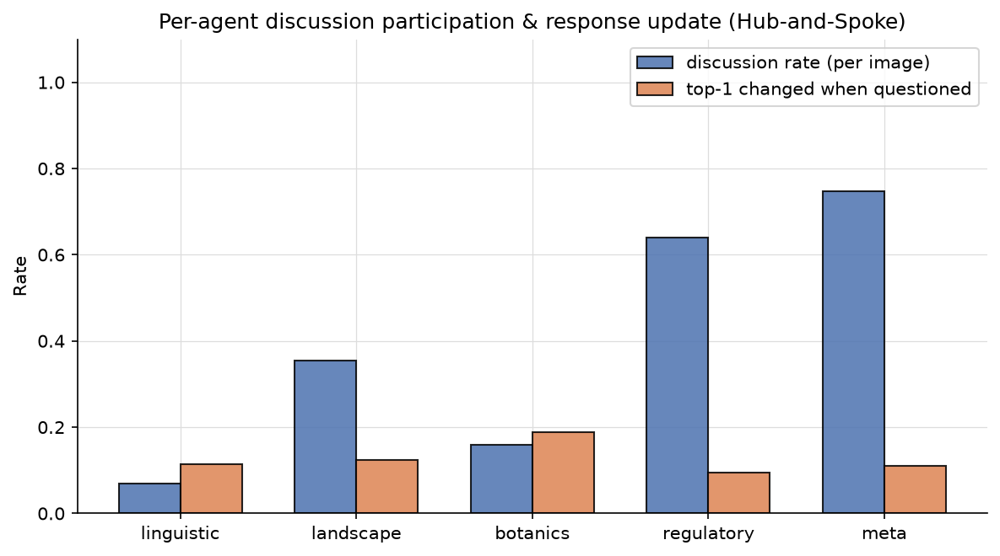
_Per-agent discussion participation and top-1 update rate when questioned_

### Discussion Activation

- Images with no discussion (judge accepted initial picks): **111**
- Images with discussion: **389** (77.8%)
- Total judge questions: **1656** (answered: 1656)
- Mean questions per discussed image: **4.3**

**Discussion rounds distribution:**

| Rounds | Count |
|---|---|
| 0 | 111 |
| 1 | 224 |
| 2 | 64 |
| 3 | 101 |

### Convergence (initial vs final plurality)

| Metric | Value |
|---|---|
| Initial plurality reached (>= 3/5) | 420 |
| Final plurality reached (>= 3/5) | 454 |
| Initial unanimous (5/5) | 84 |
| Final unanimous (5/5) | 88 |
| Same plurality top country in both phases | 482 |

### Ground-Truth Plurality Convergence

| Category | Count |
|---|---|
| Plurality on ground truth (correct) | 306 |
| Plurality on wrong country | 148 |
| No plurality (top <= 2/5) | 46 |

Of the plurality-converged images, **67.4%** landed on the ground truth.

### Per-agent Update Behaviour

Across the 985 answered queries with a parseable initial and last pick, how did each agent shift relative to the ground truth?

| Agent | Answered | Constructive | Destructive | Stayed OK | Stayed wrong | Lateral | Net truth |
|---|---|---|---|---|---|---|---|
| linguistic | 35 | 1 | 1 | 18 | 13 | 2 | +0 |
| landscape | 177 | 5 | 3 | 71 | 89 | 9 | +2 |
| botanics | 80 | 2 | 2 | 29 | 37 | 10 | +0 |
| regulatory | 319 | 9 | 3 | 173 | 117 | 17 | +6 |
| meta | 374 | 11 | 1 | 194 | 144 | 24 | +10 |

- **Constructive**: initial pick wrong, response moved onto the ground truth
- **Destructive**: initial pick correct, response moved away from the ground truth
- **Stayed OK**: both initial and final equal the ground truth
- **Stayed wrong**: both wrong on the same country
- **Lateral**: both wrong on different countries
- **Net truth**: constructive minus destructive

## 3. LLM-as-Judge Verdicts

Verdicts: 500/500

### System-level Scores

| Metric | Mean | Median | n |
|---|---|---|---|
| Judge question strategy | 0.576 | 0.500 | 500 |
| Judge synthesis quality | 0.623 | 0.750 | 500 |
| Discussion convergence | 0.442 | 0.500 | 387 |

### Per-agent Scores

| Agent | n | Role adher. | Halluc. down | Visual cons. up | Calib. up | Q-relevance up | Resp. update up |
|---|---|---|---|---|---|---|---|
| linguistic | 500 | 100.0% | 0.01 | 0.99 | 0.58 | 1.00 | 0.87 |
| landscape | 500 | 100.0% | 0.11 | 0.90 | 0.65 | 1.00 | 0.74 |
| botanics | 500 | 100.0% | 0.09 | 0.89 | 0.64 | 1.00 | 0.72 |
| regulatory | 500 | 100.0% | 0.09 | 0.92 | 0.63 | 1.00 | 0.67 |
| meta | 500 | 100.0% | 0.15 | 0.85 | 0.62 | 1.00 | 0.69 |

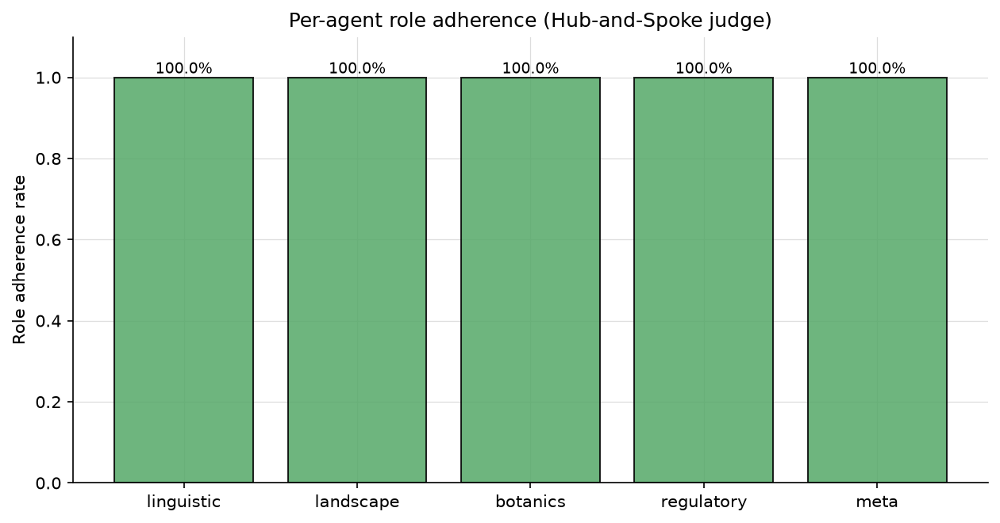
_Role adherence per agent_

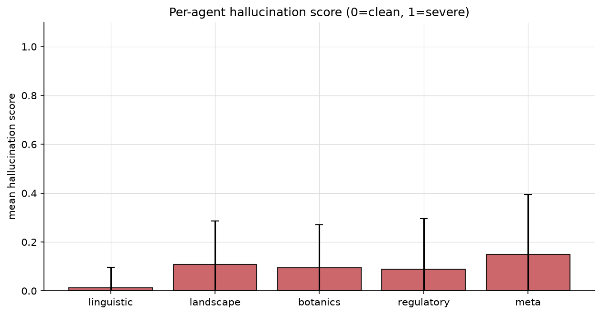
_Mean hallucination score per agent (0 = clean, 1 = severe)_

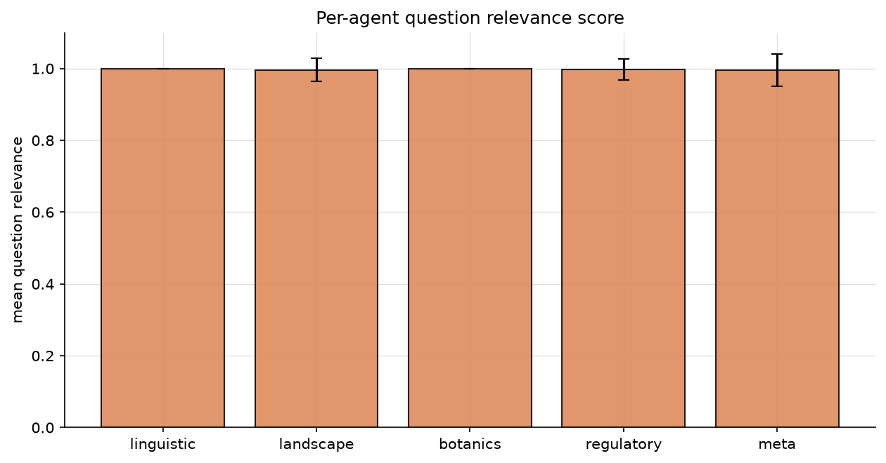
_Question relevance per agent_

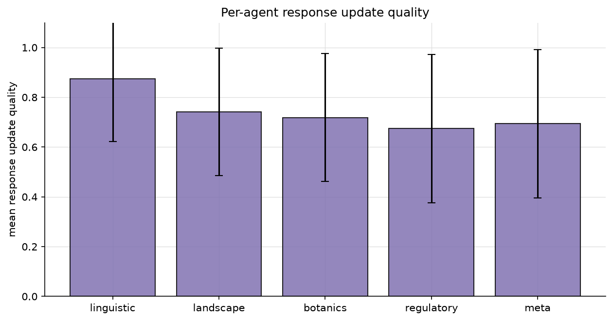
_Response update quality per agent_

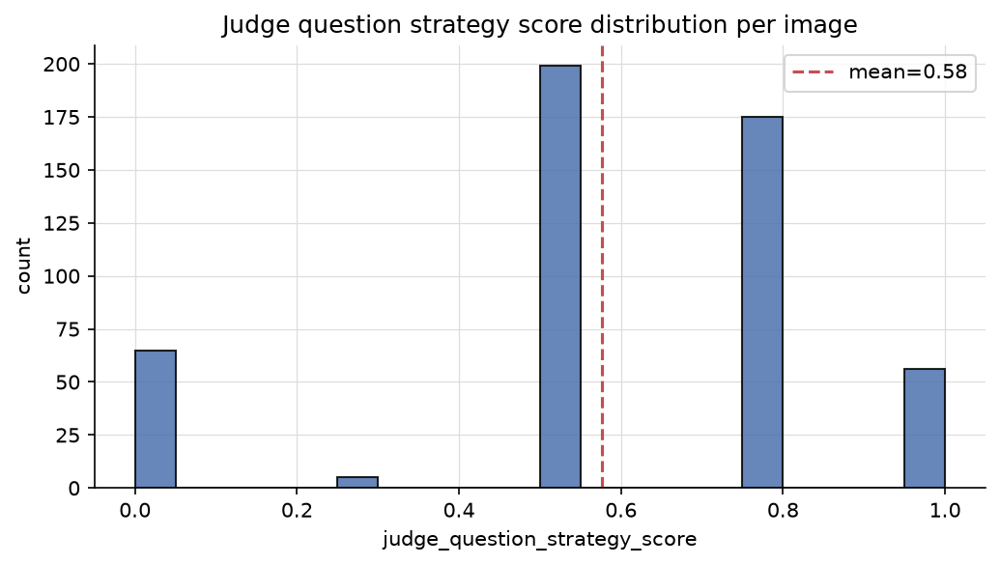
_Distribution of judge question strategy scores_

### Hallucination Examples

Concrete claims the judge flagged as not supported by the image.

**linguistic:**

| Image | Hallucinated claim |
|---|---|
| 3OuVMcpGjmm0tVfG_2 | The text 'MARAETAI' is visible on a sign. |
| 5GS2RPgTrf85UZM5_4 | The text is in Arabic, which is official in many countries. However, the specific phrasing and layout on the construction sign are common in Jordan, though not unique. |
| GbfNQanBbRoPIoek_4 | The resolution format '313-2020 DE 31 DE AGOSTO DE 2020' is visible in the image, but the agent claims the prefix '313-2020' is present, which is not supported by the image. |
| GbfNQanBbRoPIoek_4 | The phrase 'IMPACTO AMBIENTAL CATEGORIA 1' aligns specifically with the Dominican Republic's Ministry of Environment... classification system. |
| HF1MKwIFNCNb4FdM_3 | The text 'Vilabonita' on the billboard is a specific real estate development located in Colombia. |
| IozkbMt8zbdH9XCv_5 | The specific phrasing and the context of 'College of Engineering' are extremely common in India. |
| KZ2f6LqzJRyChcg8_1 | This specific street name is documented in the Catalonia region of Spain |
| KZ2f6LqzJRyChcg8_1 | This specific street name is found in the municipality of Ripoll, Catalonia, Spain |
| SkFHwlV4Z2q9fUje_3 | The toponym 'Gospostine' is a specific place name located on the island of Brač in Croatia. |
| SkFHwlV4Z2q9fUje_3 | The suffix '-ine' is common in Croatian place names, and this specific name is unique to the Croatian archipelago |

**landscape:**

| Image | Hallucinated claim |
|---|---|
| 1NJsXTxIF9GGMDxC_2 | The specific concrete drainage gutter design is very characteristic of Taiwan's central mountain roads. |
| 1NJsXTxIF9GGMDxC_5 | The road quality and utility pole style are consistent with rural Botswana infrastructure. |
| 2xnQdwiCve2rHWVt_5 | Granite rock outcrops visible on the horizon |
| 3OuVMcpGjmm0tVfG_1 | The specific rock composition and vegetation density are slightly more indicative of the Philippines |
| 3OuVMcpGjmm0tVfG_5 | The combination of arid soil, specific palm species, and the style of road infrastructure is very common in the northern and coastal regions of Mexico. |
| 3uP6lYo9pzx5Q0km_4 | The specific mix of broad-leaf tropicals and ferns suggests a high-altitude humid environment common in the Central American highlan |
| 3uP6lYo9pzx5Q0km_4 | The combination of a rough-hewn stone retaining wall with a concrete cap and a narrow, poured-concrete path is highly characteristic of rural mountainous regions in Costa Rica. |
| 3uP6lYo9pzx5Q0km_4 | The presence of dense bamboo thickets integrated with broad-leaf tropical vegetation and the specific style of concrete drainage gutters and stone-reinforced embankments are highly characteristic of Taiwan's montane regions. |
| 3uP6lYo9pzx5Q0km_5 | The deep brown, loamy forest soil visible on the embankment is characteristic of the Balkan Mountains' temperate broadleaf forests. |
| 3uP6lYo9pzx5Q0km_5 | The specific shade of green and soil composition often differs slightly from the Balkans. |

**botanics:**

| Image | Hallucinated claim |
|---|---|
| 1NJsXTxIF9GGMDxC_2 | The dense combination of subtropical broadleaf evergreen forest and the specific abundance of ferns (likely Cyathea or Dicranopteris species) on steep road embankments is highly characteristic of Taiwan's central mountain ranges. |
| 1NJsXTxIF9GGMDxC_5 | The landscape shows a classic semi-arid savanna with Vachellia (Acacia) species and dry scrubland typical of the Kalahari basin. |
| 3OuVMcpGjmm0tVfG_1 | The specific density and arrangement of the mixed garden species are slightly more typical of Philippine rural landscapes than Indonesian ones. |
| 3OuVMcpGjmm0tVfG_5 | The combination of Washingtonia robusta palms and Delonix regia (Flamboyant trees) is extremely common in the arid and semi-arid regions of Northern and Central Mexico. |
| 3uP6lYo9pzx5Q0km_4 | The specific combination of dense bamboo thickets (Bambusoideae) integrated with subtropical broadleaf evergreen forest is highly characteristic of East Asian montane regions. |
| 3uP6lYo9pzx5Q0km_4 | The bamboo morphology, specifically the thin, densely clustered culms and the way they arch, is more characteristic of East Asian species (like Phyllostachys or Bambusa) than the thick-walled, massive culms of Neotropical Guadua. |
| 3uP6lYo9pzx5Q0km_4 | The presence of dense, thin-culmed bamboo mixed with broadleaf evergreen foliage and Musa species is highly characteristic of Taiwan's mid-altitude humid forests. |
| 3uP6lYo9pzx5Q0km_5 | The dense, mixed broadleaf forest featuring species consistent with Colchic rainforests (such as Castanea sativa and various Fagus species) is highly characteristic of the Caucasus region. |
| 3uP6lYo9pzx5Q0km_5 | The extreme density of the understory and the specific lushness of the broadleaf canopy are highly characteristic of the Colchic rainforests. |
| 4UvmdTHySo6AXW4M_3 | The combination of Pinus sylvestris (Scots Pine) and Betula pendula (Silver Birch) is highly characteristic of the lowland mixed forests of Central Europe, particularly Poland. |

**regulatory:**

| Image | Hallucinated claim |
|---|---|
| 1NJsXTxIF9GGMDxC_2 | The yellow and black chevron sign is a standard Japanese 'curve' warning sign. |
| 1NJsXTxIF9GGMDxC_2 | The specific combination of the concrete U-shaped drainage gutter and the corrugated metal guardrail is highly characteristic of Japanese rural mountain roads. |
| 1NJsXTxIF9GGMDxC_2 | The absence of white delineator posts (reflective markers) on the guardrail is a strong negative indicator for Japan, where such markers are nearly ubiquitous on rural curves. |
| 1NJsXTxIF9GGMDxC_5 | The utility pole is a simple wooden pole with a basic cross-arm and porcelain insulators, which is common in rural Botswana and Namibia, but less standardized than in South Africa. |
| 3I4ZtihbhZy5qZzQ_5 | the white truck in the distance appears to have a yellow plate, which is the standard for private vehicles in Colombia |
| 3uP6lYo9pzx5Q0km_3 | The white roadside delineator posts with a red reflector on the right side and a black reflector on the left are highly characteristic of Polish road standards. |
| 4UvmdTHySo6AXW4M_3 | The broken white center line features relatively short dashes with wide gaps, which is highly characteristic of rural Russian regional roads. |
| 4UvmdTHySo6AXW4M_4 | The road features a double yellow center line and white edge lines, which is standard for South African highways. |
| 56Q4T4rpv9O9sCpP_2 | The utility pole placement on the right side of the road is common in rural South African infrastructure. |
| 56Q4T4rpv9O9sCpP_5 | The combination of left-hand traffic, yellow outer edge lines, and a white dashed center line is highly characteristic of Botswana's road standards. |

**meta:**

| Image | Hallucinated claim |
|---|---|
| 1NJsXTxIF9GGMDxC_2 | The specific U-shaped concrete drainage gutter with a flat top edge and integrated curb is a hallmark of Taiwanese mountain road infrastructure. |
| 1NJsXTxIF9GGMDxC_5 | The wooden utility pole features a single, relatively short horizontal cross-arm with insulators that are characteristic of rural Botswana's power distribution. |
| 3I4ZtihbhZy5qZzQ_5 | The concrete utility poles feature a specific tapered design and mounting hardware for power lines that is highly characteristic of Colombia. |
| 3OuVMcpGjmm0tVfG_1 | The utility poles are slender, pre-stressed concrete with a specific tapered top and mounting bracket style common in the Philippines. |
| 3OuVMcpGjmm0tVfG_1 | While Indonesia uses concrete poles, they are typically thicker or have different hole patterns for cross-arms. |
| 3OuVMcpGjmm0tVfG_1 | The combination of these poles with the specific style of elevated rural housing (bahay kubo style) strongly distinguishes this location from Indonesia or Thailand. |
| 3uP6lYo9pzx5Q0km_4 | The image shows a Google Street View Trekker (backpack) capture. Costa Rica has a very high density of Trekker coverage specifically on these types of narrow, paved rural access roads and national park trails. |
| 3uP6lYo9pzx5Q0km_4 | The concrete drainage gutters are highly standardized, pre-cast, and precisely aligned, which is a hallmark of Taiwanese rural infrastructure. |
| 3uP6lYo9pzx5Q0km_4 | The stone masonry retaining wall is a structured 'riprap' or engineered stone-fill style common in Taiwan's mountainous regions to prevent landslides, differing from the more artisanal styles found in Central America. |
| 3uP6lYo9pzx5Q0km_5 | The specific profile of the rusted guardrail, featuring a double-beam design with significant oxidation, is highly prevalent in the Dinaric Alps. |
