# VLM Council PN + PH + Tournament Evaluation Report

## TL;DR

- **Images evaluated:** 500
- **Country accuracy:** 64.8%
- **Haversine error:** mean 1,470 km, median 421 km, p90 3,144 km
- **Path A (consensus):** 0
- **Path B (no consensus):** 500

## 1. Ground-Truth Statistics

### Geo-spatial bias

- North/south bias: strong north bias (p=0.0025)
- East/west bias: no significant bias (p=0.3603)
- Error quadrants: NE=129, NW=149, SE=101, SW=121
- Mean |lat error|: 4.78°, mean |lng error|: 13.27°

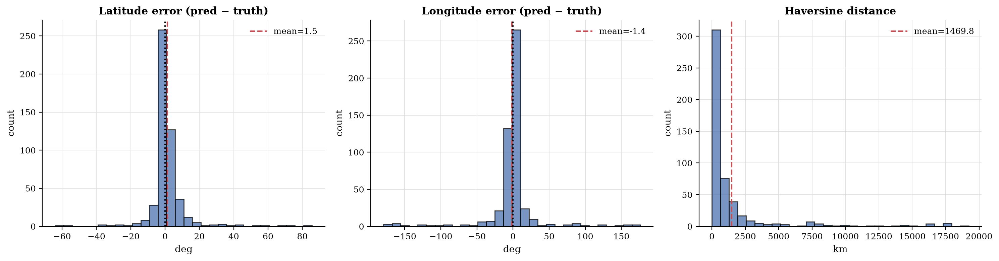

_Figure 1: Latitude/longitude error distribution._

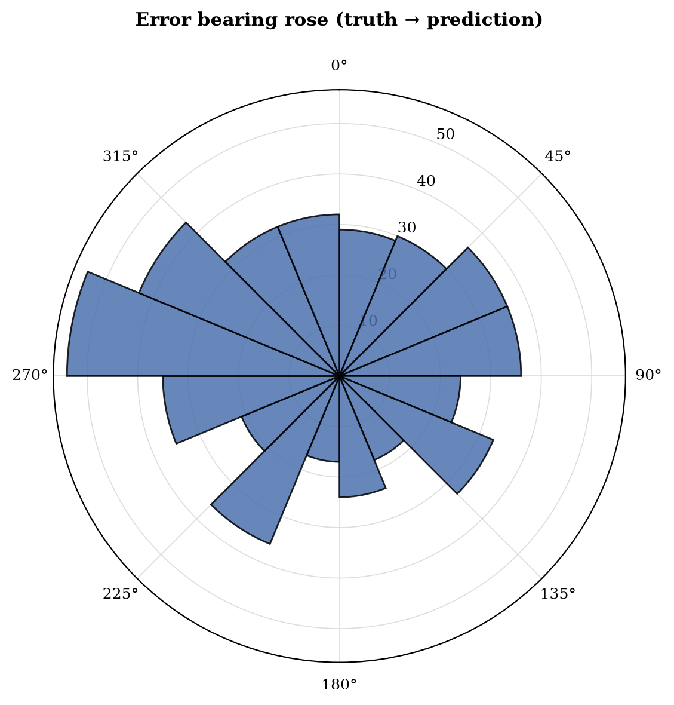

_Figure 2: Bearing of prediction errors._

### Top confusion pairs

| Truth | Predicted | Count |
|---|---|---|
| south africa | botswana | 5 |
| canada | united states | 4 |
| peru | colombia | 4 |
| indonesia | thailand | 3 |
| panama | puerto rico | 3 |
| uruguay | brazil | 3 |
| indonesia | philippines | 2 |
| argentina | mexico | 2 |
| norway | sweden | 2 |
| south africa | australia | 2 |
| bolivia | brazil | 2 |
| montenegro | croatia | 2 |
| argentina | colombia | 2 |
| sweden | finland | 2 |
| ukraine | russia | 2 |

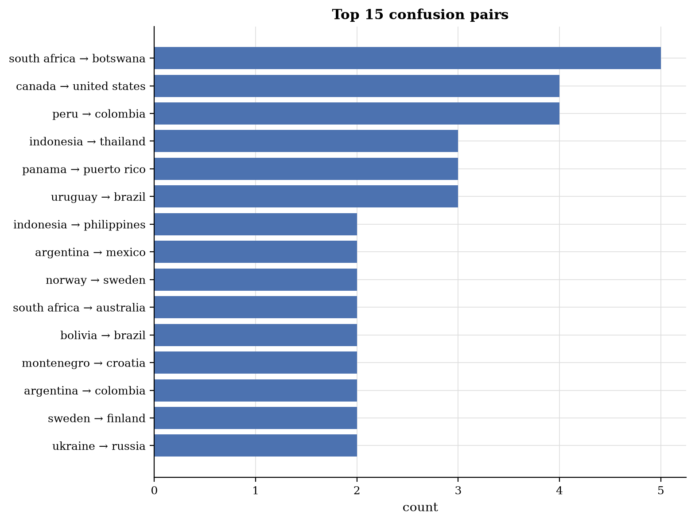

_Figure 3: Confusion matrix of top-15 confused country pairs._

### Asymmetric confusions

| Country A | Country B | A→B | B→A | Asymmetry |
|---|---|---|---|---|
| south africa | botswana | 5 | 0 | +5 |
| peru | colombia | 4 | 0 | +4 |
| indonesia | thailand | 3 | 0 | +3 |
| canada | united states | 4 | 1 | +3 |
| panama | puerto rico | 3 | 0 | +3 |
| uruguay | brazil | 3 | 0 | +3 |
| indonesia | philippines | 2 | 0 | +2 |
| norway | sweden | 2 | 0 | +2 |
| south africa | australia | 2 | 0 | +2 |
| bolivia | brazil | 2 | 0 | +2 |

### Per-agent metrics

### Initial round

| Agent | n | Top-1 | Top-3 | Coverage |
|---|---|---|---|---|
| linguistic | 107 | 78.5% | 86.0% | 91.6% |
| landscape | 500 | 64.8% | 79.8% | 81.6% |
| botanics | 500 | 63.6% | 78.8% | 80.6% |
| regulatory | 500 | 64.8% | 79.4% | 81.8% |
| meta | 500 | 62.6% | 78.4% | 80.0% |

### Country round (Path B)

| Agent | n | Top-1 | Top-3 | Coverage |
|---|---|---|---|---|
| linguistic | 108 | 78.7% | 85.2% | 92.6% |
| landscape | 499 | 63.9% | 76.8% | 81.6% |
| botanics | 498 | 64.3% | 77.5% | 80.7% |
| regulatory | 500 | 62.8% | 78.0% | 81.2% |
| meta | 500 | 62.2% | 76.2% | 76.8% |

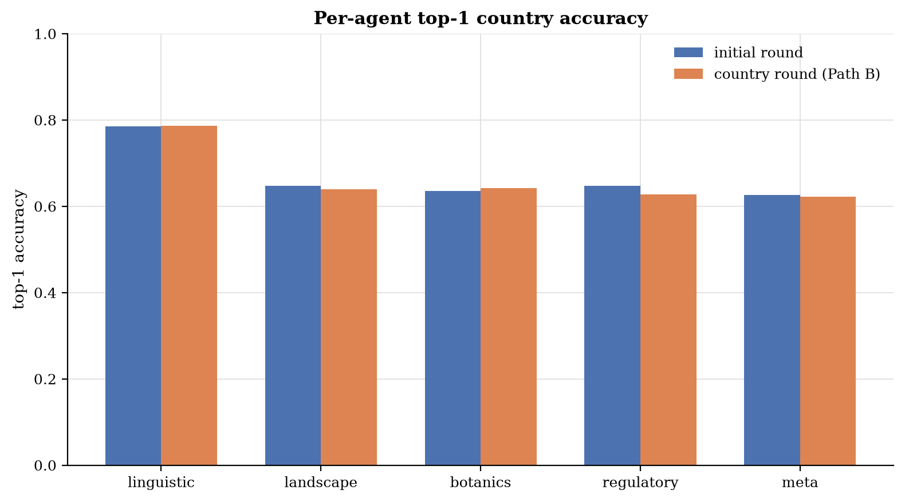

_Figure 4: Per-agent top-1 accuracy._

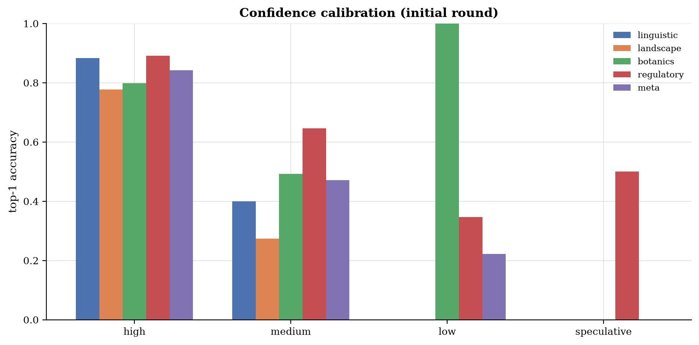

_Figure 5: Per-agent top-1 vs. confidence calibration._

### Confidence calibration

Each specialist annotates **every candidate** in its list with a confidence label (`high` / `medium` / `low` / `speculative`). These labels are then handed to the tournament judge as evidence, so the relevant question is: when an agent assigns label X to a country, in what fraction of those (image, country) pairs was that country the ground truth?

### Per-label hit-rate, P(truth | label)

| Agent | high (n) | medium (n) | low (n) | speculative (n) |
|---|---|---|---|---|
| linguistic | 83% (94) | 8% (221) | 6% (50) | , (0) |
| landscape | 58% (545) | 10% (800) | 3% (410) | 0% (441) |
| botanics | 56% (371) | 22% (834) | 2% (660) | 1% (317) |
| regulatory | 88% (131) | 39% (547) | 11% (664) | 1% (630) |
| meta | 83% (217) | 27% (668) | 6% (534) | 2% (319) |
| **average** | **66%** (1358) | **22%** (3070) | **6%** (2318) | **1%** (1707) |

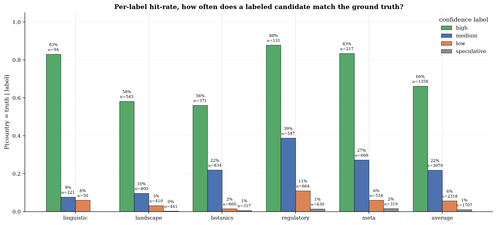

_Figure 6: Per-label hit-rate: how often a labeled candidate equals the ground truth. A well-calibrated agent shows monotonically falling bars (high > medium > low > speculative)._

### Top-1 Brier / ECE

Single-number summary of how well the **top-1 pick's** confidence label correlates with being correct. Brier = mean squared error of `p` (mapped via `{'high': 0.9, 'medium': 0.6, 'low': 0.3, 'speculative': 0.1}`) against the 0/1 outcome; ECE = expected calibration error across confidence bins. Lower is better for both.

| Agent | n | Brier | ECE |
|---|---|---|---|
| linguistic | 107 | 0.136 | 0.053 |
| landscape | 500 | 0.218 | 0.175 |
| botanics | 500 | 0.220 | 0.106 |
| regulatory | 500 | 0.197 | 0.038 |
| meta | 500 | 0.209 | 0.098 |
| **average** | **2107** | **0.207** | **0.089** |

### Geographic heatmap

Per-country true-positive rate (TPR = correct ÷ truth = country) and false-positive counts. Macro-averaged TPR across 91 countries with truth: **55.0%**.

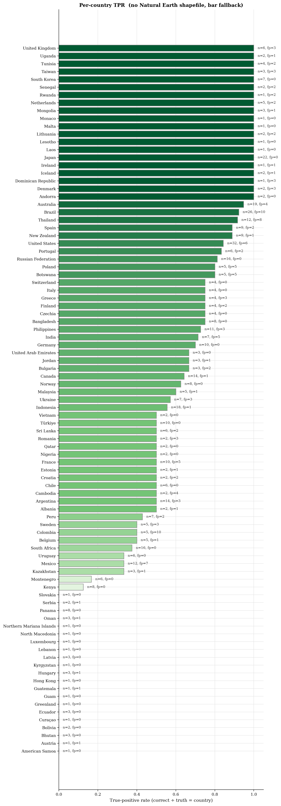

_Figure 7: Per-country TPR (green) with FP outlines (red)._

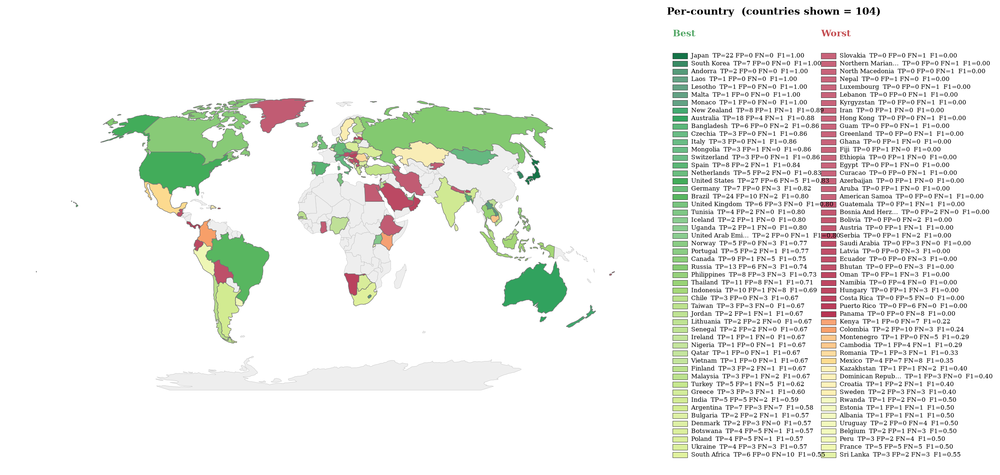

_Figure 8: Per-country F1 = 2·P·R / (P+R), divergent around the run's macro-F1. Green = above-average, red = below-average. Alpha scales with √(TP+FP+FN) so low-evidence countries fade out. Used for an imbalanced dataset because raw TPR/recall ignores false positives._

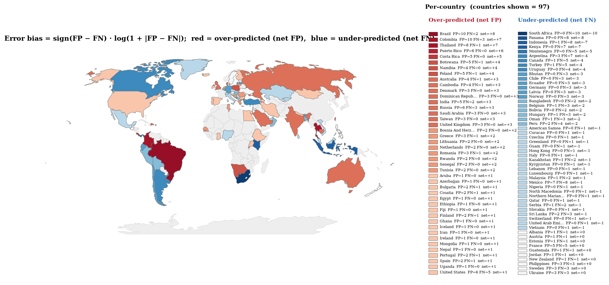

_Figure 9: Per-country error bias (FP − FN)/(FP + FN), TP ignored. Red = the country is over-predicted (false positives only); blue = the country is missed (false negatives only); pastel tones = mixed FP/FN. Only countries with ≥ 1 error are drawn. Outline thickness ∝ error volume._

### Worst-performing countries (lowest TPR, ≥ 2 truth samples)

| Country | n_truth | n_correct | n_pred | n_fp | TPR |
|---|---|---|---|---|---|
| Bhutan | 3 | 0 | 0 | 0 | 0.0% |
| Bolivia | 2 | 0 | 0 | 0 | 0.0% |
| Ecuador | 3 | 0 | 0 | 0 | 0.0% |
| Hungary | 3 | 0 | 1 | 1 | 0.0% |
| Latvia | 3 | 0 | 0 | 0 | 0.0% |
| Oman | 3 | 0 | 1 | 1 | 0.0% |
| Panama | 8 | 0 | 0 | 0 | 0.0% |
| Serbia | 2 | 0 | 1 | 1 | 0.0% |
| Kenya | 8 | 1 | 1 | 0 | 12.5% |
| Montenegro | 6 | 1 | 1 | 0 | 16.7% |

### Top false-positive predictions

| Country | n_predicted | n_false_positive | PPV |
|---|---|---|---|
| Brazil | 34 | 10 | 70.6% |
| Colombia | 12 | 10 | 16.7% |
| Thailand | 19 | 8 | 57.9% |
| Mexico | 11 | 7 | 36.4% |
| Puerto Rico | 6 | 6 | 0.0% |
| Russia | 19 | 6 | 68.4% |
| United States | 33 | 6 | 81.8% |
| Botswana | 9 | 5 | 44.4% |
| Costa Rica | 5 | 5 | 0.0% |
| France | 10 | 5 | 50.0% |

## 2. Approach Dynamics

### Region narrowing funnel and tournament bracket dynamics

This approach narrows the world to a region, builds a candidate pool inside that region, then runs a 1v1 country tournament. The tables below trace whether the ground truth survives each narrowing gate and how the bracket behaves. All values are computed from the raw result.json by compute_dynamics().

Candidate pool size: mean 4.65, median 5, max 8.

**Tournament shape distribution**

| Shape | Count | Share |
|---|---|---|
| full-bracket | 405 | 81.0% |
| 3-way (semi+final) | 61 | 12.2% |
| final-only | 20 | 4.0% |
| walkover | 14 | 2.8% |

**Ground truth narrowing funnel** (n = 500 images with ground truth)

Each stage is a binary check on whether the ground truth was still reachable after that narrowing step. A gate that drops the truth can never be recovered downstream, so the survival rate strictly falls.

| Stage | Description | Truth survives |
|---|---|---|
| **S0** | GT region proposed | 484/500 (96.8%) |
| **S1** | GT region survived PN vote | 464/500 (92.8%) |
| **S2** | GT region confirmed | 438/500 (87.6%) |
| **S2b** | GT region confirmed or runner up | 464/500 (92.8%) |
| **S3** | GT country in candidate pool | 421/500 (84.2%) |
| **S3b** | GT country in pool top 3 | 379/500 (75.8%) |
| **S3c** | GT country is pool top seed | 314/500 (62.8%) |
| **S4** | GT country reached tournament final | 356/500 (71.2%) |
| **S5** | GT country won tournament | 324/500 (64.8%) |
| **S6** | Final judge country is GT | 324/500 (64.8%) |

**Tournament bracket dynamics**

| Metric | Value |
|---|---|
| Total 1v1 matches | 1357 |
| Judge agrees with specialists | 1339 (98.7%) |
| Judge overruled a specialist | 18 (1.3%) |
| Bracket upsets (lower seed beat higher seed) | 67 (4.9%) |
| Finals played | 486 |
| Top seed wins final | 473 (97.3%) |

**Tournament decisions vs ground truth**

A decisive match is one where the truth was on exactly one side, so the tournament could get it right or wrong. Upsets that move toward truth are the value the bracket adds over the pool ranking.

| Metric | Value |
|---|---|
| Decisive matches | 736 |
| Toward truth (winner = truth) | 651 (88.5%) |
| Away from truth (winner not truth) | 85 |
| Both wrong (truth not in match) | 621 |
| Upsets total | 67 |
| Upsets toward truth | 10 (14.9%) |
| Upsets away from truth | 7 |

### Pipeline funnel, where does the truth get lost?

Each stage is a binary check on whether the **ground-truth country** was still reachable after that stage of the pipeline. Cumulative survival = truth survived all stages from S0 up to and including this one. Conditional rate = survivors / survivors of the previous stage (i.e. attrition at *this* step). Wilson 95% confidence intervals.

> **Bottleneck:** stage S1, _Confirmed/proposed region matches truth_. Conditional survival here is **0.0%** [0.0%, 0.9%]. This is the single largest attrition step in the pipeline.

| Stage | Description | Cumulative survival | Conditional on prev |
|---|---|---|---|
| **S0** | Truth in any initial-round top-K | 87.6% [84.4%, 90.2%] | 87.6% [84.4%, 90.2%] |
| **S1** | Confirmed/proposed region matches truth | 0.0% [0.0%, 0.8%] | 0.0% [0.0%, 0.9%] |
| **S2** | Truth in country-round top-K (Path B) / region OK (Path A) | 0.0% [0.0%, 0.8%] | n/a |
| **S3** | Truth in candidate pool | 0.0% [0.0%, 0.8%] | n/a |
| **S4** | Truth wins the tournament final | 0.0% [0.0%, 0.8%] | n/a |
| **S5** | Final predicted country matches truth | 64.8% [60.5%, 68.9%] | n/a |

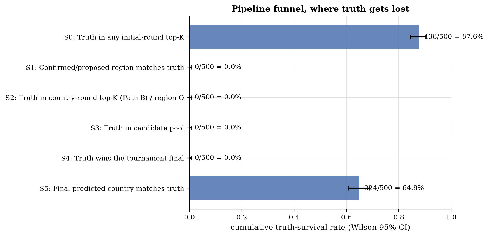

_Figure 10: Pipeline funnel survival per stage with Wilson 95% CI._

### Oracle ceilings, counterfactual accuracy if a stage were perfect

Each oracle row shows what the end-to-end accuracy *would* be if a particular pipeline stage made no mistakes. The gap between **Actual** and an oracle is the upper bound of accuracy gain achievable by fixing that stage.

| Scenario | Accuracy (95% CI) | Δ vs. actual |
|---|---|---|
| Actual pipeline | 64.8% [60.5%, 68.9%] | ,  |
| Baseline: majority-vote of 5 agents | 65.0% [60.7%, 69.1%] | +0.2% |
| Oracle region (region always correct) | 65.2% [60.9%, 69.2%] | +0.4% |
| Oracle pool (truth always in pool) | 90.2% [87.3%, 92.5%] | +25.4% |
| Oracle tournament (truth wins if in pool) | 84.2% [80.7%, 87.1%] | +19.4% |

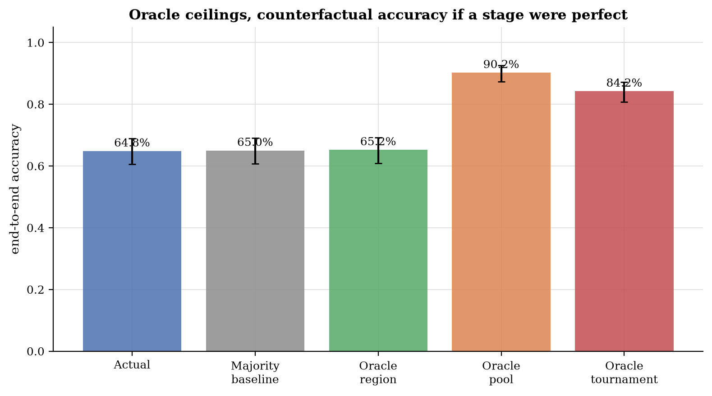

_Figure 11: Counterfactual accuracy under perfect-stage oracles._

### Tournament diagnostics

The tournament judge runs every match twice (forward + reverse positions) in parallel and only commits to a winner if both runs agree. On disagreement we fall back to pool-rank (higher seed wins). `country_a` / `country_b` are bracket slots, not prompt positions, so the relevant bias signal is the **agreement distribution** plus a **pool-seed-bias** check, not slot-win-rate.

**Agreement distribution** (n=1357 matches):
- both runs agree: 98.7% [97.9%, 99.2%]
- only forward run produced a winner: 0.0% [0.0%, 0.3%]
- only reverse run produced a winner: 0.0% [0.0%, 0.3%]
- runs picked different winners → pool-rank tiebreak: 1.3% [0.8%, 2.1%]
- both runs failed to parse → pool-rank tiebreak: 0.0% [0.0%, 0.3%]

**Pool-rank tiebreak rate**: 1.3% [0.8%, 2.1%] of all matches resolved without unanimous symmetric agreement.

**Pool-seed bias** (does the higher-seeded country win? n=1357 matches with distinct seeds): 95.1% [93.8%, 96.1%]
- :warning: Higher-seeded country wins significantly more than 55%. The pool-rank tiebreak and/or the judge are leaning on seed information.

**Truth match-win rate** (matches where truth was one of the two contenders, n=736): 88.5% [85.9%, 90.6%]

**Truth outcomes split by agreement type:**

| Agreement | Truth-in-match | Truth won | Win rate |
|---|---|---|---|
| agree | 733 | 650 | 88.7% |
| disagree | 3 | 1 | 33.3% |

**Specific pair failures** (truth lost to the same opponent ≥ 2 times):

| Truth | Lost to | Count |
|---|---|---|
| South Africa | Namibia | 4 |
| Canada | United States | 4 |
| Indonesia | Philippines | 2 |
| Norway | Sweden | 2 |
| Indonesia | Thailand | 2 |
| Bhutan | Nepal | 2 |
| Sweden | Finland | 2 |
| Latvia | Lithuania | 2 |
| Chile | Peru | 2 |
| South Africa | Botswana | 2 |
| Uruguay | Brazil | 2 |

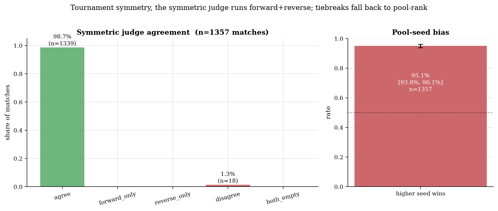

_Figure 12: Symmetric judge agreement distribution and pool-seed-bias check._

### Agreement vs. accuracy

Bucketed by how many of the 5 agents picked the same top-1 country in the initial round. A steep gradient indicates that initial-round agent agreement is a strong predictor of correctness.

| Agents agreeing on top-1 | n | Accuracy (95% CI) |
|---|---|---|
| 5/5 | 91 | 86.8% [78.4%, 92.3%] |
| 4/5 | 281 | 74.0% [68.6%, 78.8%] |
| 3/5 | 76 | 27.6% [18.8%, 38.6%] |
| 2/5 | 50 | 32.0% [20.8%, 45.8%] |
| 1/5 | 2 | 0.0% [0.0%, 65.8%] |

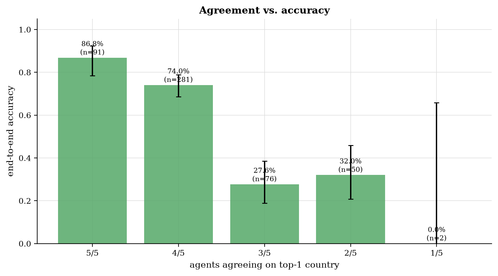

_Figure 13: Initial-round agent agreement vs. final accuracy._

### Path A vs. Path B

Path A = region consensus reached after the initial round. Path B = no consensus, agents do a second region-constrained assessment before the tournament.

| Metric | Path A | Path B |
|---|---|---|
| n | 0 | 500 |
| Country accuracy | n/a | 64.8% [60.5%, 68.9%] |
| Median haversine | 0 km | 421 km |
| Truth in pool | 0.0% (0) | 84.2% (421) |
| Tournament survival when in pool | 0.0% | 77.0% |
| Mean total seconds | 0.0 s | 118.9 s |

### Severity of errors

Of **176** wrong predictions (out of 500 total):
- **Near-miss** (haversine < 500 km): 35
- **Same-region wrong**: 0
- **Wrong region**: 0

### Near-miss examples (first 15)

| Image | Truth | Pred | Haversine |
|---|---|---|---|
| 1NJsXTxIF9GGMDxC_3 | serbia | bosnia and herzegovina | 130 km |
| 3I4ZtihbhZy5qZzQ_1 | bangladesh | india | 77 km |
| 3uP6lYo9pzx5Q0km_2 | norway | sweden | 218 km |
| 5bPlIRT7eGN79a2E_5 | chile | argentina | 427 km |
| 6ypQOh9cOoE7WaWH_1 | montenegro | bosnia and herzegovina | 138 km |
| 8Uo6ejwXYqmp9av3_2 | norway | denmark | 421 km |
| DKGAIVKGYnLWmMy9_1 | montenegro | croatia | 287 km |
| DKGAIVKGYnLWmMy9_5 | serbia | romania | 425 km |
| JnTw9kl2nWPFaoUg_2 | france | belgium | 84 km |
| KZ2f6LqzJRyChcg8_2 | latvia | lithuania | 232 km |
| Lz6IDBZmUTr5oPdV_1 | hungary | poland | 484 km |
| MjBPBTn3iUXdebSu_2 | south africa | botswana | 452 km |
| MjBPBTn3iUXdebSu_5 | türkiye | greece | 474 km |
| N2IFsQAIIcXPuNKn_2 | montenegro | bulgaria | 489 km |
| STQGgl6Uh9muExNb_3 | ukraine | russia | 493 km |

### Tournament anchoring, does the bracket actually re-rank?

Of 486 images with a non-trivial pool (≥ 2 candidates), the tournament winner equals the top-seeded candidate **91.4%** of the time (n=444). When anchored, the seed was correct **67.3%** of the time.

Of the 42 re-ranked images (winner ≠ top seed): **17** flipped *toward* truth, **7** flipped *away* from truth, **18** were neutral (truth missed either way). Net help: **+10** images.

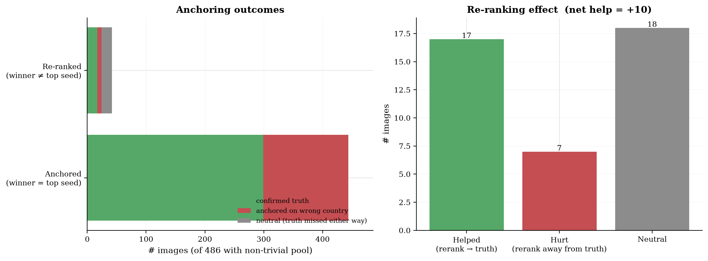

_Figure 14: Anchoring vs. re-ranking outcomes. Left: stacked outcomes split by whether the tournament confirmed the top seed; right: net effect of re-ranking on truth recovery._

### Re-ranking saved truth (examples)

| Image | Top seed | Tournament winner | Truth |
|---|---|---|---|
| 1NJsXTxIF9GGMDxC_5 | Botswana | **South Africa** | south africa |
| 2xnQdwiCve2rHWVt_5 | Spain | **Portugal** | portugal |
| 3I4ZtihbhZy5qZzQ_3 | United States | **Canada** | canada |
| 3uP6lYo9pzx5Q0km_3 | Poland | **Czech Republic** | czechia |
| 56Q4T4rpv9O9sCpP_3 | India | **Sri Lanka** | sri lanka |
| 6fGwHxCTvCbaK77Q_2 | Cambodia | **India** | india |
| 74bPHM081cMUaNKT_1 | Kazakhstan | **Mongolia** | mongolia |
| EEI3fwu4iZvPT2zP_1 | Ethiopia | **Rwanda** | rwanda |

### Re-ranking flipped away from truth (examples)

| Image | Top seed (= truth) | Tournament winner | Truth |
|---|---|---|---|
| 1NJsXTxIF9GGMDxC_1 | Kyrgyzstan | Azerbaijan | **kyrgyzstan** |
| JfPkjboMSjCsG1Qu_4 | Colombia | Mexico | **colombia** |
| aKDWzyoV4cSA6Da2_3 | Australia | New Zealand | **australia** |
| aKDWzyoV4cSA6Da2_5 | Belgium | Netherlands | **belgium** |
| lesmx8gOI1f44LS4_1 | Spain | Portugal | **spain** |
| qREuLz0JK8CfSFMC_3 | Germany | Denmark | **germany** |
| sf2wEErB2IDY3qJ5_1 | Kazakhstan | Mongolia | **kazakhstan** |

### RAG utility, does retrieval actually move the needle?

Of 486 images with a non-trivial pool, **3.1%** had at least one verified RAG reference surface (n=15; mean refs/image = 0.1, mean countries with refs/image = 0.1).

Pre-filter eliminations (driving-side / road-marking veto): **136** candidates dropped before the tournament; truth was killed by the pre-filter **0 time(s)** (rate 0.0%).

Per-veto breakdown, when truth gets killed here, either the LLM's observation of the image is wrong or the country-side reference table is wrong.

| Veto kind | Eliminations | Truth killed | Truth-kill rate |
|---|---|---|---|
| driving-side | 42 | 0 | 0.0% |
| road-marking | 94 | 0 | 0.0% |

Per-match ref availability (across 1357 tournament matches): both sides have refs in 12, asymmetric in **22** (1.6%), neither side has refs in 1323.

In the 22 asymmetric matches, the ref-side wins **90.9%** of the time (n=20). When the ref-side wins, it equals the truth **55.0%** of the time, i.e. ref-asymmetry steers toward truth in 11 of 20 ref-side wins.

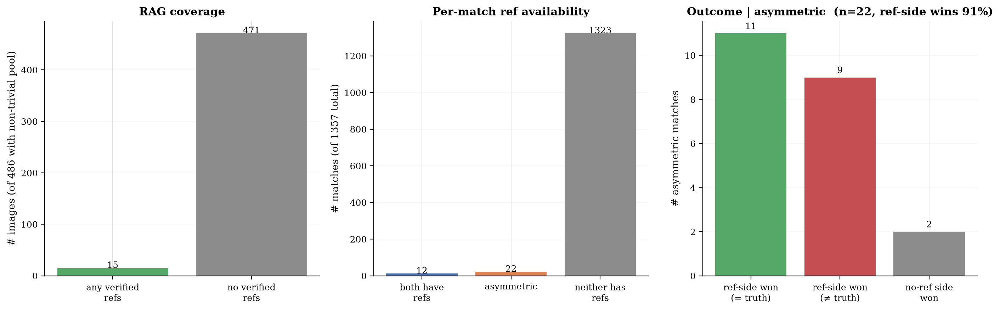

_Figure 15: RAG utility: coverage (left), per-match ref availability (middle), and outcome of asymmetric matches (right). 'ref-side won (= truth)' is the only column that demonstrates RAG steering the bracket toward the correct answer._

### RAG-asymmetric matches won by the ref-side (= truth)

| Image | Round | Winner | Truth |
|---|---|---|---|
| 1NJsXTxIF9GGMDxC_5 | semi-2 | South Africa | south africa |
| 1NJsXTxIF9GGMDxC_5 | final | South Africa | south africa |
| 3uP6lYo9pzx5Q0km_3 | semi-2 | Czech Republic | czechia |
| 3uP6lYo9pzx5Q0km_3 | final | Czech Republic | czechia |
| 56Q4T4rpv9O9sCpP_4 | semi-1 | Australia | australia |
| 56Q4T4rpv9O9sCpP_4 | final | Australia | australia |
| amHvOfYODNHwXiJg_1 | semi-1 | Norway | norway |
| amHvOfYODNHwXiJg_2 | semi-2 | Sweden | sweden |

### RAG-asymmetric matches where ref-side won but truth was the other side

| Image | Round | Ref-side winner | Truth |
|---|---|---|---|
| aKDWzyoV4cSA6Da2_2 | semi | Oman | **united arab emirates** |
| aKDWzyoV4cSA6Da2_5 | final | Netherlands | **belgium** |
| lesmx8gOI1f44LS4_1 | final | Portugal | **spain** |

## 3. LLM-as-Judge Verdicts

### LLM-as-judge verdicts (v2)

- Verdicts: 500/500
- Constructive synthesis rate: 100.0% (n=500)

### Per-agent quantitative scores

| Agent | n | Role adher. | Hallucination ↓ | Visual cons. ↑ | Calibration ↑ |
|---|---|---|---|---|---|
| linguistic | 500 | 100.0% | 0.01 | 0.99 | 0.57 |
| landscape | 500 | 100.0% | 0.01 | 0.91 | 0.68 |
| botanics | 500 | 100.0% | 0.02 | 0.90 | 0.66 |
| regulatory | 500 | 100.0% | 0.02 | 0.91 | 0.64 |
| meta | 500 | 100.0% | 0.06 | 0.87 | 0.68 |

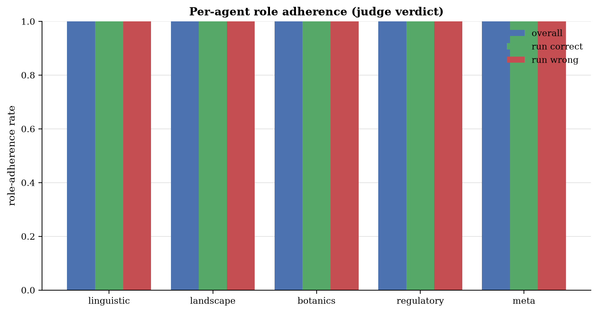

_Figure 16: Per-agent role adherence rate (overall, when run correct, when run wrong)._

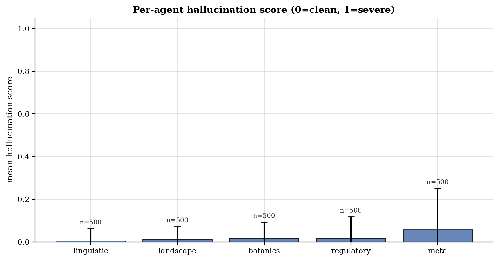

_Figure 17: Per-agent mean hallucination score (0 = clean, 1 = severe)._

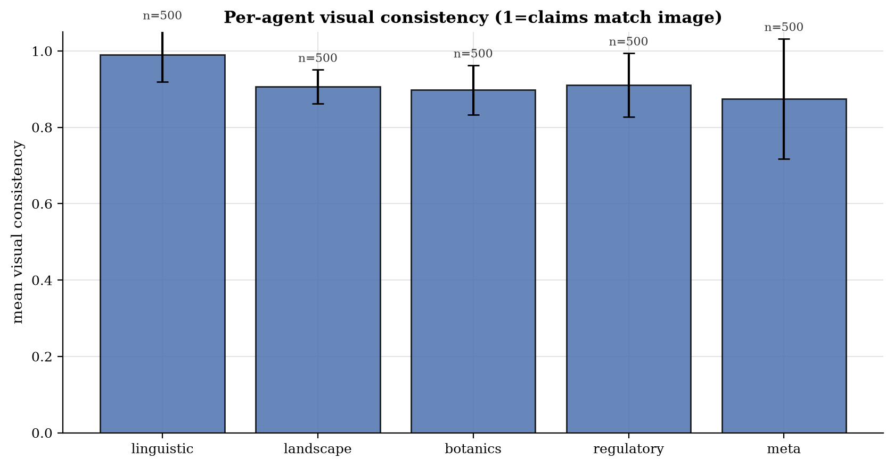

_Figure 18: Per-agent mean visual consistency._

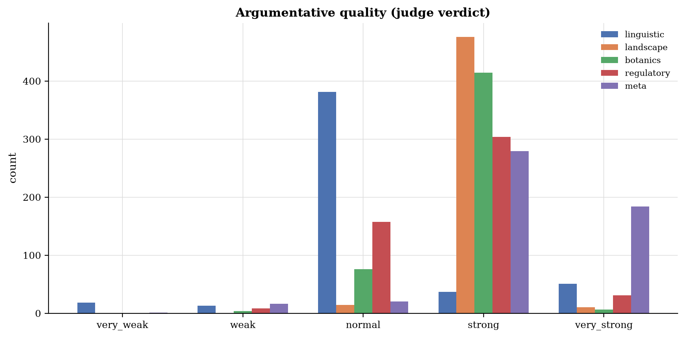

_Figure 19: Argumentative quality histogram per agent._

### Tournament failure attribution

For matches where the truth was in the candidate pool but did not win, the judge classifies the cause. Counterfactual winnable rate: **26.6%** (173 attributable losses).

| Failure reason | Count |
|---|---|
| `not_applicable` | 327 |
| `agent_misled_in_tournament` | 58 |
| `agent_misled_pre_pool` | 57 |
| `ambiguous_evidence` | 32 |
| `judge_misjudgment` | 23 |
| `missing_rag_refs` | 3 |

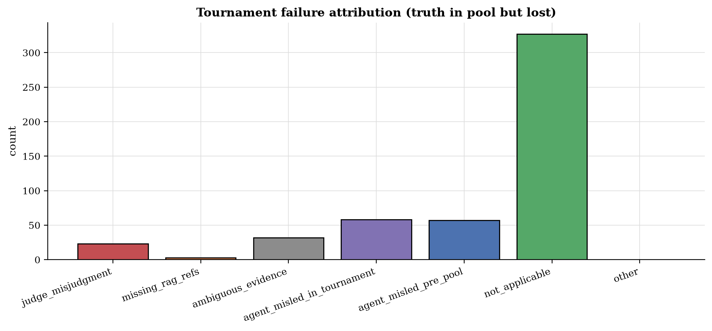

_Figure 20: Tournament failure attribution histogram._

### Failure examples (first 10)

| Image | Reason | Lost to | Round | Counterfactual? |
|---|---|---|---|---|
| 1NJsXTxIF9GGMDxC_1 | `agent_misled_in_tournament` | Azerbaijan | final | yes |
| 1NJsXTxIF9GGMDxC_2 | `agent_misled_in_tournament` | Taiwan | final | no |
| 1NJsXTxIF9GGMDxC_3 | `ambiguous_evidence` | Bosnia and Herzegovina | final | no |
| 2xnQdwiCve2rHWVt_1 | `judge_misjudgment` | Brazil | final | yes |
| 3I4ZtihbhZy5qZzQ_1 | `judge_misjudgment` | India | final | yes |
| 3I4ZtihbhZy5qZzQ_5 | `agent_misled_in_tournament` | Colombia | final | yes |
| 3OuVMcpGjmm0tVfG_1 | `agent_misled_in_tournament` | Philippines | semi-1 | yes |
| 3OuVMcpGjmm0tVfG_5 | `agent_misled_pre_pool` | Mexico | final | no |
| 3uP6lYo9pzx5Q0km_2 | `judge_misjudgment` | Sweden | final | yes |
| 3uP6lYo9pzx5Q0km_4 | `judge_misjudgment` | Thailand | semi-1 | yes |

### Hallucination examples

Concrete claims the judge flagged as not supported by the image. Up to 5 examples per agent.

### linguistic

| Image | Score | Hallucinated claim |
|---|---|---|
| 8Uo6ejwXYqmp9av3_2 | 0.50 | claimed 'MURMESTER' is 'strongly indicative of Denmark' (it is a standard Norwegian term for bricklayer) |
| JnTw9kl2nWPFaoUg_5 | 0.50 | 'Muki' is a common name/word in Luganda, the primary language of Uganda |
| oIqmyQzBGtaIeI84_4 | 0.75 | The text 'SOLGAS' refers to a gas distribution company that operates primarily in Colombia. |
| oIqmyQzBGtaIeI84_4 | 0.75 | The text 'SOLGAS' refers to a well-known LPG gas distribution company operating in Colombia. |
| z2mhsiTu4DYWixQf_5 | 0.75 | The sign on the left contains the word 'سورية' (Syria/Syrian) |

### landscape

| Image | Score | Hallucinated claim |
|---|---|---|
| 1NJsXTxIF9GGMDxC_2 | 0.50 | claimed concrete drainage gutters are 'very characteristic of Taiwan's central mountain ranges' (also common in Malaysia/Australia) |
| 3OuVMcpGjmm0tVfG_1 | 0.50 | claimed 'volcanic-looking grey rocky embankments' are 'highly characteristic of the Philippine archipelago' (a specific, unsupported generalization used to bias the decision) |
| 3OuVMcpGjmm0tVfG_1 | 0.50 | claimed 'volcanic rock roadside borders' are 'highly characteristic of the Philippine archipelago' |
| 3uP6lYo9pzx5Q0km_2 | 0.50 | Claimed the terrain is 'more gently rolling than typical Norwegian landscapes' to justify Sweden over Norway; the image shows a gentle slope that is equally characteristic of coastal Norway. |
| 3uP6lYo9pzx5Q0km_2 | 0.50 | Repeatedly cited 'exposed granite outcrops' as a strong indicator for Sweden, whereas the image shows generic rocky outcrops common to both countries. |

### botanics

| Image | Score | Hallucinated claim |
|---|---|---|
| 1NJsXTxIF9GGMDxC_2 | 0.50 | claimed fern abundance is 'highly characteristic of Taiwan's central mountain ranges' (generic to humid tropics) |
| 4UvmdTHySo6AXW4M_5 | 0.50 | claimed 'Prosopis juliflora (mesquite)' visible in scrub — not identifiable from image |
| 4UvmdTHySo6AXW4M_5 | 0.50 | claimed 'Triticum aestivum (Winter Wheat)' — crop is too distant to identify species |
| 5l0GTCFZI877KxkV_4 | 0.20 | botanics agent cited 'terraced paddy fields' in Phase 1 evidence; the foreground field appears to be a harvested grassy plot or fallow field, not a flooded paddy. |
| 6ypQOh9cOoE7WaWH_3 | 0.25 | claimed 'eucalyptus plantations' are visible — the background vegetation is generic montane forest/scrub, not clearly identifiable as eucalyptus. |

### regulatory

| Image | Score | Hallucinated claim |
|---|---|---|
| 1NJsXTxIF9GGMDxC_1 | 0.50 | The green fuel price totem displays 'AZS', which is the standard abbreviation for Azerbaijan Manat (AZN) fuel stations. |
| 1NJsXTxIF9GGMDxC_2 | 0.75 | claimed concrete drainage gutter style is 'very common in mountainous regions of Taiwan' (implies exclusivity not supported by image) |
| 8Uo6ejwXYqmp9av3_2 | 0.50 | claimed 'Murmester' terminology is 'strongly Danish' (misleading/incorrect) |
| IozkbMt8zbdH9XCv_3 | 0.20 | regulatory agent claimed 'blue and white painted curbs' are a 'frequent regulatory marker in Iranian cities' (unsupported generalization). |
| JfPkjboMSjCsG1Qu_5 | 0.50 | regulatory agent: 'blue rectangular informational sign with white border' (Image shows blue sign with yellow border) |

### meta

| Image | Score | Hallucinated claim |
|---|---|---|
| 1NJsXTxIF9GGMDxC_1 | 0.50 | The green fuel price totem is highly characteristic of SOCAR stations in Azerbaijan. |
| 1NJsXTxIF9GGMDxC_2 | 0.75 | claimed concrete drainage gutter is a 'hallmark of infrastructure in Japan and Taiwan' (ignores other regions with similar infrastructure) |
| 3I4ZtihbhZy5qZzQ_5 | 0.75 | The Google Street View camera car hood is visible and has a distinct grey/silver color and shape characteristic of the coverage in several South American countries, particularly Colombia. |
| 3I4ZtihbhZy5qZzQ_5 | 0.75 | The specific Google car hood color (greyish-white) and the style of the concrete perimeter walls... is very common in Colombian urban/industrial areas. |
| 4UvmdTHySo6AXW4M_5 | 0.20 | claimed 'specific blur patterns... consistent with Google Trekker' — generic artifacts cited as specific evidence |
