# VLM Council Progressive Narrowing + Parallel Hypotheses Evaluation Report

- **Country accuracy:** 64.0% (n = 500)
- **Haversine error:** median 439 km, mean 1,549 km
- **Path split:** Path A (consensus) 315, Path B (no consensus) 185
- **Region narrowing quality:** 0.709 mean (0.750 median)

## 1. Ground-Truth Statistics

### Headline Metrics

| Metric | Value |
|--------|-------|
| Country accuracy | 64.0% |
| Median haversine distance | 439 km |
| Mean haversine distance | 1,549 km |
| N images | 500 |
| Path A (consensus) | 315 |
| Path B (no consensus) | 185 |

### Geographic Bias

- North bias: strong north bias (p=0.0067)
- East bias:  no significant bias (p=0.8476)

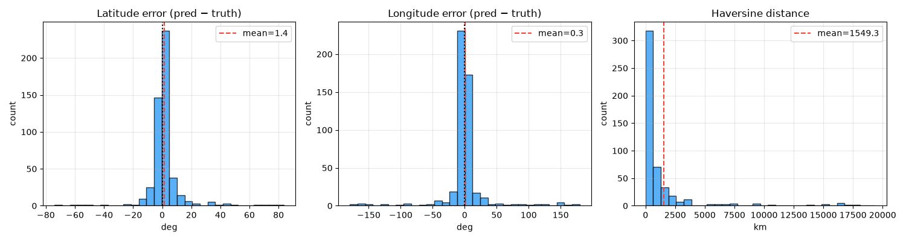
_1. Lat/lng/haversine error distributions_

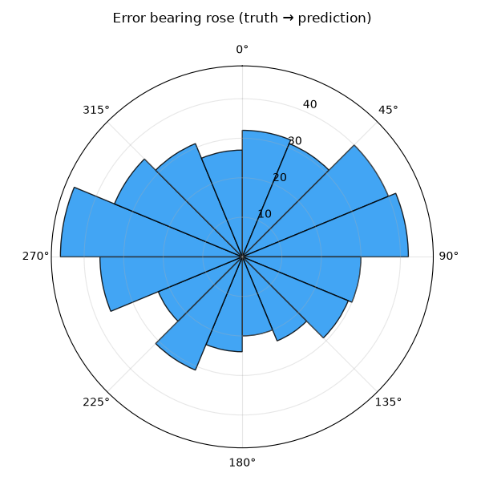
_2. Error bearing rose_

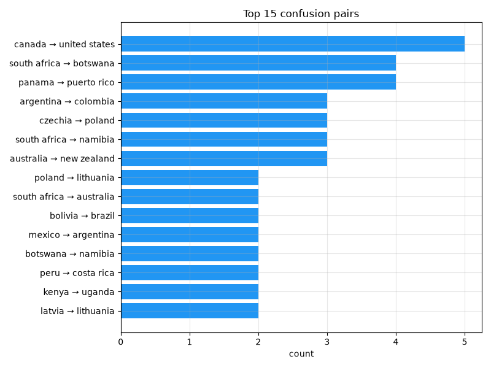
_3. Top confusion pairs_

**Top confusion pairs:**

| Truth | Predicted | Count |
|-------|-----------|-------|
| canada | united states | 5 |
| south africa | botswana | 4 |
| panama | puerto rico | 4 |
| argentina | colombia | 3 |
| czechia | poland | 3 |
| south africa | namibia | 3 |
| australia | new zealand | 3 |
| poland | lithuania | 2 |
| south africa | australia | 2 |
| bolivia | brazil | 2 |

### Per-agent Accuracy (Initial Round)

| Agent | Top-1 | Top-3 | Coverage | n |
|-------|-------|-------|----------|---|
| linguistic | 78.5% | 86.0% | 91.6% | 107 |
| landscape | 63.4% | 79.6% | 81.4% | 500 |
| botanics | 63.1% | 78.4% | 79.4% | 499 |
| regulatory | 64.6% | 77.4% | 78.3% | 443 |
| meta | 62.5% | 74.5% | 74.5% | 499 |

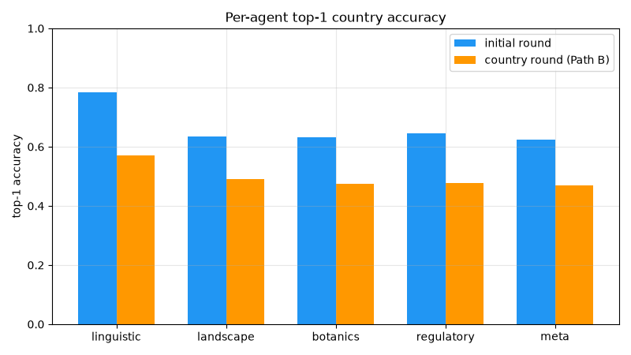
_4. Per-agent top-1 accuracy_

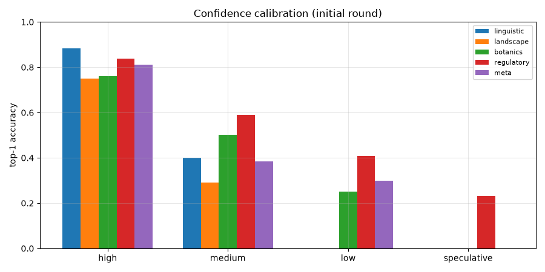
_5. Confidence calibration by agent_

### Geographic World Maps

Per-country accuracy across 91 countries with truth. Macro-averaged TPR: **55.0%**.

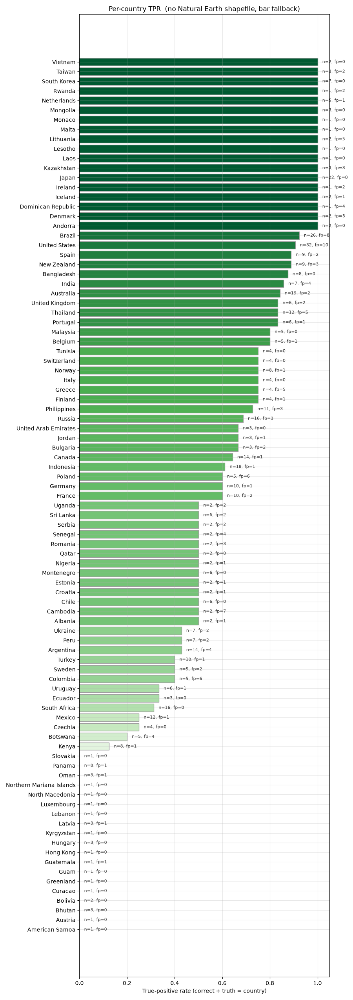
_Per-country true-positive rate (green) with false-positive outlines (red)._

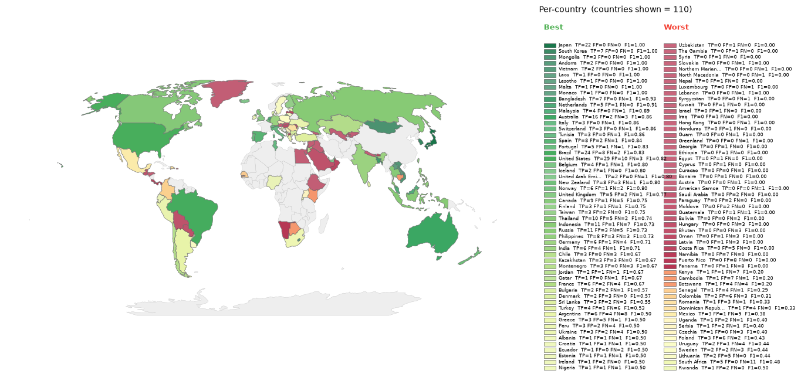
_Per-country F1, divergent around the run's macro-F1. Green = above average, red = below._

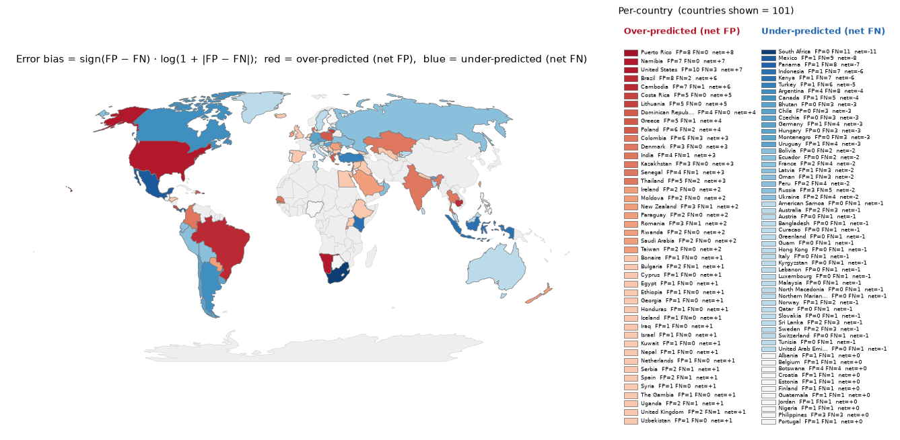
_Per-country error bias (FP-FN)/(FP+FN). Red = over-predicted, blue = missed._

## 2. Approach Dynamics

Progressive Narrowing routes each image down Path A (region consensus, jump straight to the judge) or Path B (parallel hypotheses + a country re-assessment inside the confirmed region). This section traces where the truth country survives or is lost.

### Path A / Path B Split

| Metric | Value |
|--------|-------|
| Path A (region consensus) | 315 (63.0%) |
| Path B (no consensus) | 185 (37.0%) |
| Region consensus reached | 315 (63.0%) |

### Region Narrowing Funnel

Does the confirmed region actually contain the ground-truth country?

| Split | Region matches GT | n |
|-------|-------------------|---|
| All | 86.7% | 498 |
| Path A | 95.2% | 315 |
| Path B | 72.1% | 183 |

### Country Narrowing Funnel (Path B initial to re-assessment)

Per-agent initial pick vs country re-assessment pick (n = 745 Path B agent images):

| Category | Count | Share |
|----------|-------|-------|
| Constructive (initial wrong, re-assessment moved onto GT) | 35 | 4.7% |
| Destructive (initial correct, re-assessment moved off GT) | 43 | 5.8% |
| Stayed correct (both initial and re-assessment on GT) | 329 | 44.2% |
| Stayed wrong (both wrong, same country) | 225 | 30.2% |
| Lateral (both wrong, different countries) | 113 | 15.2% |

### Pipeline Funnel

Where does the truth country get lost?

| Stage | Description | Cumul. survival | Conditional |
|-------|-------------|----------------|-------------|
| S0 | Truth in any agent's initial top-K | 86.6% (433/500) | 86.6% |
| S1 | Confirmed/proposed region matches truth's region | 85.2% (426/500) | 98.4% |
| S2 | Truth in country-round top-K (Path B) / region OK (Path A) | 80.6% (403/500) | 94.6% |
| S3 | Truth in country hypothesis pool | 80.0% (400/500) | 99.3% |
| S4 | Final prediction matches truth | 64.0% (320/500) | 80.0% |

> **Bottleneck:** S4, Final prediction matches truth  (conditional rate 80.0%, 95% CI [75.8%, 83.6%])

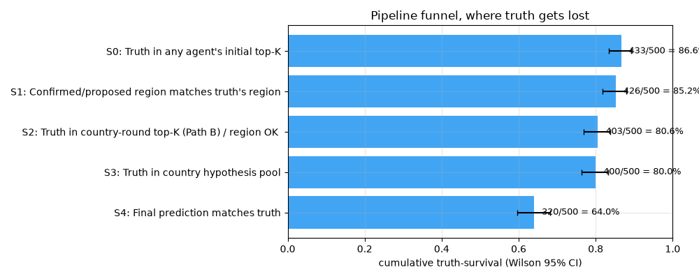
_6. Cumulative truth-survival through the PN pipeline_

#### Oracle Ceilings

| Scenario | Accuracy |
|----------|----------|
| Actual | 64.0% |
| Majority-vote baseline | 63.6% |
| Oracle region (perfect region step) | 88.0% |
| Oracle pool (truth always in hypothesis pool) | 88.2% |
| Oracle decision (perfect final judge) | 82.2% |

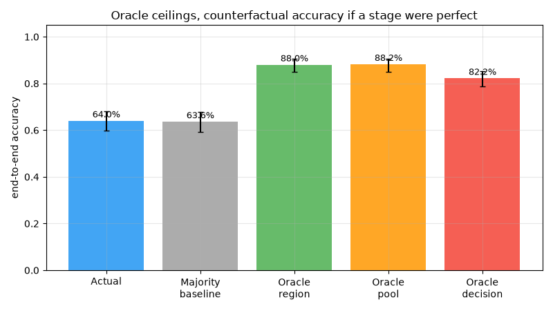
_7. Counterfactual accuracy if each stage were perfect_

#### Agreement vs. Accuracy

| Agents agree | n | Accuracy |
|-------------|---|----------|
| 5/5 | 90 | 88.9% |
| 4/5 | 238 | 76.1% |
| 3/5 | 103 | 42.7% |
| 2/5 | 64 | 21.9% |
| 1/5 | 5 | 20.0% |

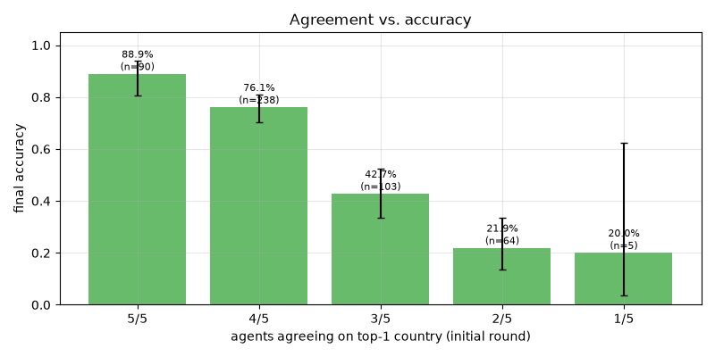
_8. Final accuracy by initial-round agent agreement level_

#### Path A vs. Path B

| Metric | Path A | Path B |
|--------|--------|--------|
| n | 315 | 185 |
| Accuracy | 73.0% | 48.6% |
| Median haversine | 323 km | 936 km |
| Truth in pool | 91.4% | 66.5% |

#### Error Severity

- Near miss (< 500 km): 41 / 180
- Same region, wrong country: 114 / 180
- Wrong region: 58 / 180

## 3. LLM-as-Judge Verdicts

Verdicts: 500/500  Constructive synthesis: 69.4%

### Progressive Narrowing Scores

| Metric | Mean | Median | n |
|--------|------|--------|---|
| Region narrowing, all | 0.709 | 0.750 | 500 |
| Region narrowing, Path A | n/a | n/a | 0 |
| Region narrowing, Path B | n/a | n/a | 0 |
| Hypothesis pool, all | 0.435 | 0.500 | 500 |
| Hypothesis pool, truth in pool | n/a | n/a | 0 |
| Hypothesis pool, truth NOT in pool | 0.435 | 0.500 | 500 |

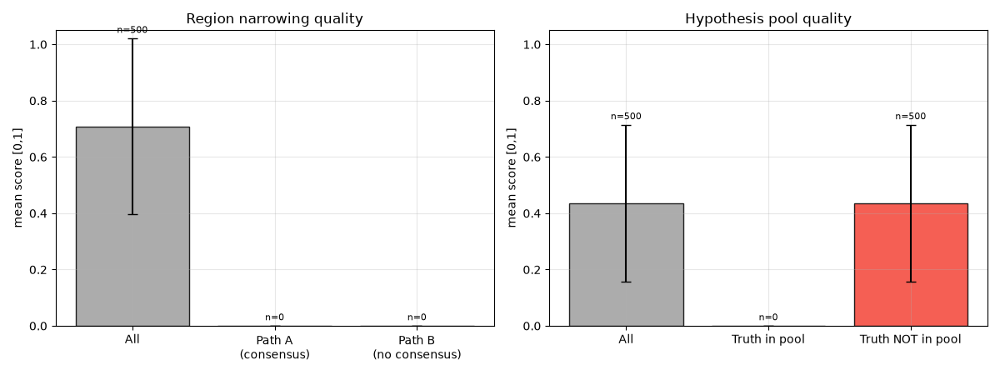
_9. Region narrowing quality and hypothesis pool quality_

### Per-agent Judge Scores

| Agent | Role adherence | Hall. (down) | Visual cons. | Conf. calib. |
|-------|----------------|--------------|--------------|--------------|
| linguistic | 100.0% | 0.000 | 0.887 | 0.494 |
| landscape | 100.0% | 0.017 | 0.928 | 0.561 |
| botanics | 100.0% | 0.028 | 0.904 | 0.536 |
| regulatory | 100.0% | 0.005 | 0.942 | 0.553 |
| meta | 100.0% | 0.020 | 0.904 | 0.549 |

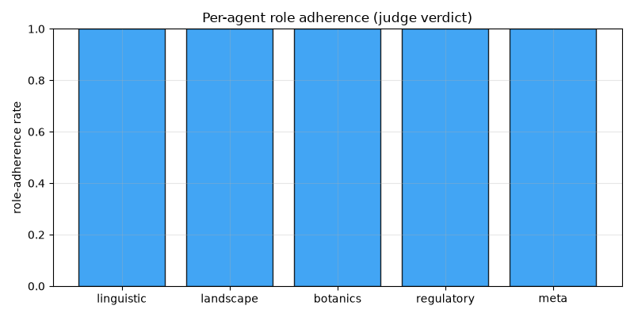
_10. Role adherence per agent_

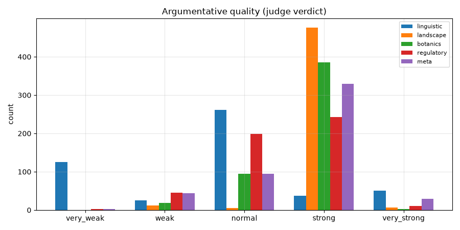
_11. Argumentative quality histogram_

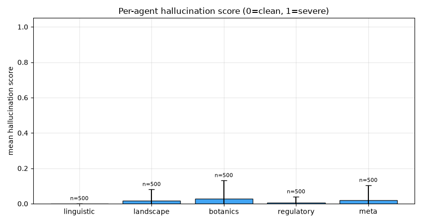
_12. Hallucination score per agent_

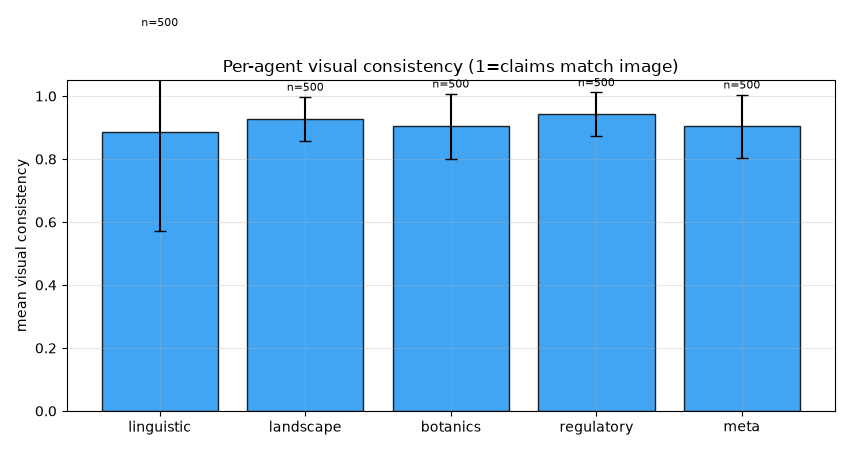
_13. Visual consistency per agent_

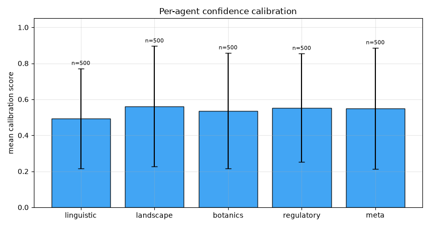
_14. Confidence calibration per agent_

### Hallucination Examples

**landscape:**

| Image | Score | Claim |
|-------|-------|-------|
| 1NJsXTxIF9GGMDxC_1 | 0.750 | claimed 'semi-arid vegetation... typical of the South Caucasus' |
| 1NJsXTxIF9GGMDxC_1 | 0.750 | claimed 'specific style of road infrastructure... characteristic of rural Azerbaijan' |
| 9lNwy1vjD53PTSwt_1 | 0.100 | claimed 'dark, fertile chernozem' is visible (soil is not visible under grass) |
| JfPkjboMSjCsG1Qu_4 | 0.200 | claimed 'calcareous/light-colored soil visible' — soil is not clearly visible under vegetation |
| NqhvwHTYOTtGmZgm_1 | 0.500 | claimed 'volcanic basaltic soil' — the ground is clearly grey gravel/sand, not black basalt. |

**botanics:**

| Image | Score | Claim |
|-------|-------|-------|
| 1NJsXTxIF9GGMDxC_1 | 0.750 | claimed 'South Caucasus regional flora' |
| 1NJsXTxIF9GGMDxC_1 | 0.750 | claimed 'vegetation is typical of the lowland plains... of Azerbaijan' |
| 3uP6lYo9pzx5Q0km_5 | 0.300 | Identified Castanea sativa (Sweet Chestnut) — while plausible, the image resolution is insufficient to confirm this specific species. |
| 6ypQOh9cOoE7WaWH_3 | 0.200 | claimed 'eucalyptus plantations' are visible in the background hills |
| 74bPHM081cMUaNKT_2 | 0.200 | claimed 'Arctic-alpine tundra' — image shows arid scrubland, not tundra. |

**regulatory:**

| Image | Score | Claim |
|-------|-------|-------|
| 1NJsXTxIF9GGMDxC_1 | 0.500 | claimed 'green fuel price totem displays A3C' |
| 9lNwy1vjD53PTSwt_5 | 0.200 | claimed 'left-hand driving' based on vehicle position, which is ambiguous in a POV shot. |
| JfPkjboMSjCsG1Qu_5 | 0.200 | claimed 'specific symbol' on the blue sign — the sign is a generic bus stop symbol, not a specific regional marker. |
| Y2QhKx7sks9MExvw_5 | 0.100 | claimed 'right-hand traffic' — vehicle is driving away, no clear lane position |
| ZMSyLdPt9G7MhcHC_4 | 0.200 | claimed red/green curbs are a 'common regulatory marking in Guatemala' |

**meta:**

| Image | Score | Claim |
|-------|-------|-------|
| 1NJsXTxIF9GGMDxC_1 | 0.500 | claimed 'green fuel price totem is characteristic of SOCAR stations in Azerbaijan' |
| 3uP6lYo9pzx5Q0km_4 | 0.800 | Claimed 'Google Trekker camera blur' is visible at the bottom of the image. |
| 3uP6lYo9pzx5Q0km_4 | 0.800 | Claimed 'Trekker camera' is common in Costa Rican forest paths. |
| 56Q4T4rpv9O9sCpP_5 | 0.750 | claimed 'distinct Google Street View halo... characteristic of the camera rig used in Botswana' |
| 56Q4T4rpv9O9sCpP_5 | 0.750 | claimed 'simple wooden poles... differs from the more reinforced concrete poles often seen in neighboring South Africa' |
