# VLM Council Tournament Only Evaluation Report

- **Images evaluated:** 500
- **Country accuracy:** 67.8%
- **Haversine error:** mean 1,412 km, median 395 km, p90 2,731 km

## 1. Ground-Truth Statistics

### Headline metrics

| Metric | Value |
|---|---|
| Country accuracy | 67.8% |
| Median haversine | 395 km |
| Mean haversine | 1,412 km |
| N images | 500 |

### Geo-spatial bias

- North/south bias: strong north bias (p=0.0073)
- East/west bias: no significant bias (p=0.5408)
- Error quadrants: NE=137, NW=148, SE=96, SW=119
- Mean |lat error|: 4.72°, mean |lng error|: 12.50°

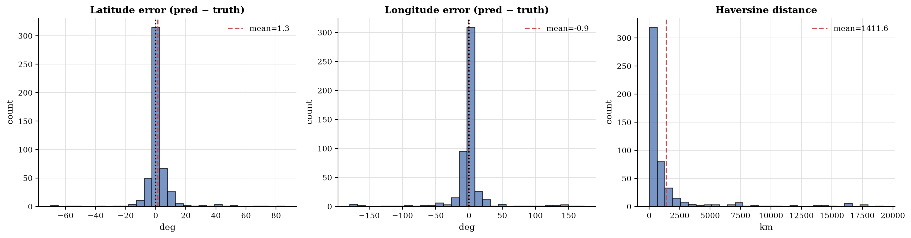

_Figure 1: Latitude/longitude error distribution._

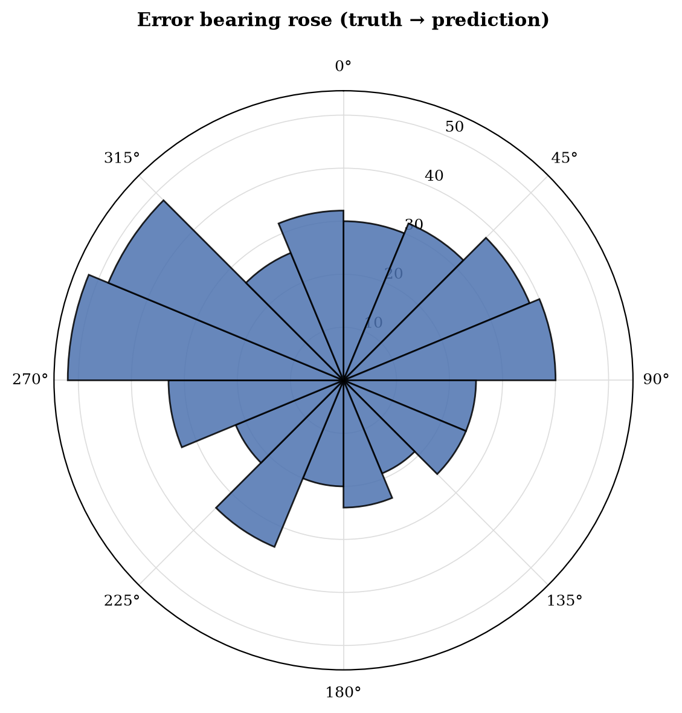

_Figure 2: Bearing of prediction errors._

#### Top confusion pairs

| Truth | Predicted | Count |
|---|---|---|
| canada | united states | 4 |
| south africa | botswana | 3 |
| south africa | namibia | 3 |
| panama | puerto rico | 3 |
| uruguay | brazil | 3 |
| indonesia | philippines | 2 |
| argentina | mexico | 2 |
| norway | sweden | 2 |
| bolivia | brazil | 2 |
| botswana | namibia | 2 |
| peru | colombia | 2 |
| montenegro | croatia | 2 |
| sweden | finland | 2 |
| indonesia | thailand | 2 |
| russia | ukraine | 2 |

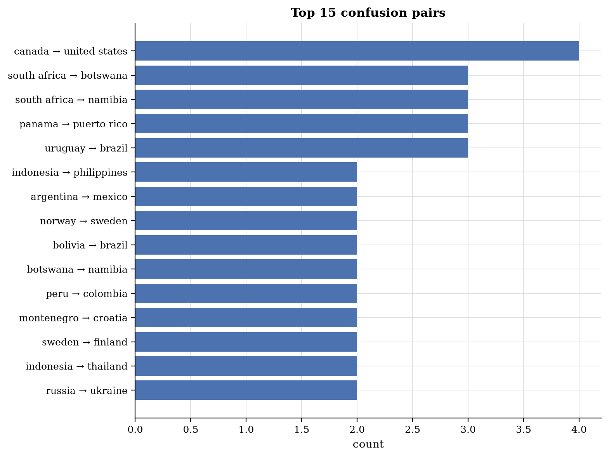

_Figure 3: Confusion matrix of top-15 confused country pairs._

#### Asymmetric confusions

| Country A | Country B | A→B | B→A | Asymmetry |
|---|---|---|---|---|
| canada | united states | 4 | 0 | +4 |
| south africa | botswana | 3 | 0 | +3 |
| south africa | namibia | 3 | 0 | +3 |
| panama | puerto rico | 3 | 0 | +3 |
| uruguay | brazil | 3 | 0 | +3 |
| indonesia | philippines | 2 | 0 | +2 |
| bolivia | brazil | 2 | 0 | +2 |
| botswana | namibia | 2 | 0 | +2 |
| peru | colombia | 2 | 0 | +2 |
| montenegro | croatia | 2 | 0 | +2 |

### Geographic heatmap

Per-country true-positive rate (TPR = correct ÷ truth = country) and false-positive counts. Macro-averaged TPR across 91 countries with truth: **56.2%**.

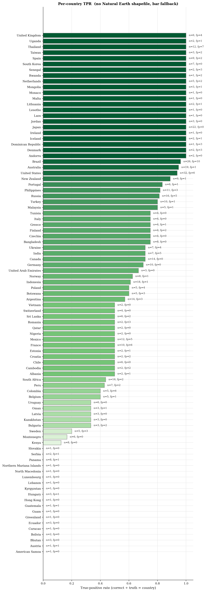

_Figure 4: Per-country TPR (green) with FP outlines (red)._

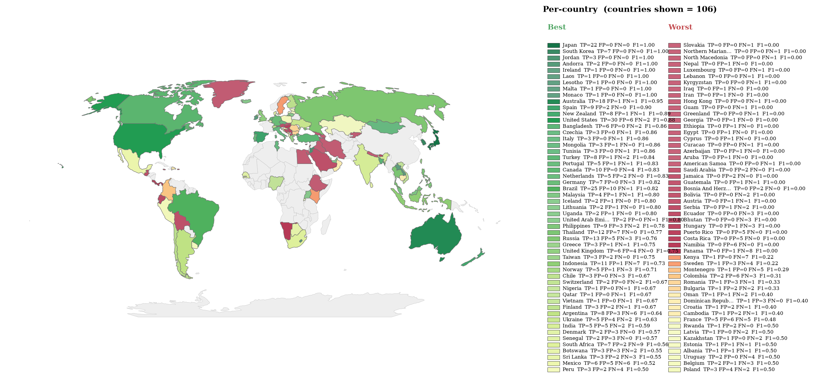

_Figure 5: Per-country F1 = 2·P·R / (P+R), divergent around the run's macro-F1. Green = above-average, red = below-average. Alpha scales with √(TP+FP+FN) so low-evidence countries fade out. Used for an imbalanced dataset because raw TPR/recall ignores false positives._

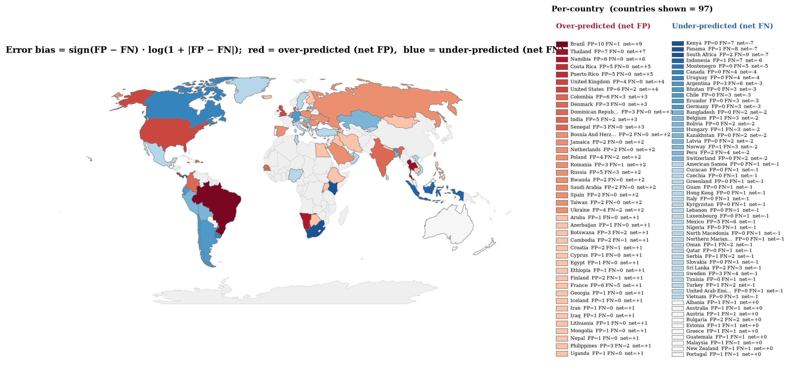

_Figure 6: Per-country error bias (FP − FN)/(FP + FN), TP ignored. Red = the country is over-predicted (false positives only); blue = the country is missed (false negatives only); pastel tones = mixed FP/FN. Only countries with ≥ 1 error are drawn. Outline thickness ∝ error volume._

#### Worst-performing countries (lowest TPR, at least 2 truth samples)

| Country | n_truth | n_correct | n_pred | n_fp | TPR |
|---|---|---|---|---|---|
| Bhutan | 3 | 0 | 0 | 0 | 0.0% |
| Bolivia | 2 | 0 | 0 | 0 | 0.0% |
| Ecuador | 3 | 0 | 0 | 0 | 0.0% |
| Hungary | 3 | 0 | 1 | 1 | 0.0% |
| Panama | 8 | 0 | 1 | 1 | 0.0% |
| Serbia | 2 | 0 | 1 | 1 | 0.0% |
| Kenya | 8 | 1 | 1 | 0 | 12.5% |
| Montenegro | 6 | 1 | 1 | 0 | 16.7% |
| Sweden | 5 | 1 | 4 | 3 | 20.0% |
| Bulgaria | 3 | 1 | 3 | 2 | 33.3% |

#### Top false-positive predictions

| Country | n_predicted | n_false_positive | PPV |
|---|---|---|---|
| Brazil | 35 | 10 | 71.4% |
| Thailand | 19 | 7 | 63.2% |
| Colombia | 8 | 6 | 25.0% |
| France | 11 | 6 | 45.5% |
| Namibia | 6 | 6 | 0.0% |
| United States | 36 | 6 | 83.3% |
| Costa Rica | 5 | 5 | 0.0% |
| India | 10 | 5 | 50.0% |
| Mexico | 11 | 5 | 54.5% |
| Puerto Rico | 5 | 5 | 0.0% |

### Confidence calibration

Each specialist annotates **every candidate** in its list with a confidence label (`high` / `medium` / `low` / `speculative`). These labels are then handed to the tournament judge as evidence, so the relevant question is: when an agent assigns label X to a country, in what fraction of those (image, country) pairs was that country the ground truth?

#### Per-label hit-rate, P(truth | label)

| Agent | high (n) | medium (n) | low (n) | speculative (n) |
|---|---|---|---|---|
| linguistic | 83% (94) | 8% (215) | 5% (56) | , (0) |
| landscape | 58% (545) | 10% (801) | 3% (409) | 0% (445) |
| botanics | 56% (367) | 22% (834) | 1% (648) | 1% (326) |
| regulatory | 88% (131) | 39% (544) | 11% (667) | 1% (629) |
| meta | 83% (217) | 27% (668) | 6% (532) | 2% (322) |
| **average** | **66%** (1354) | **22%** (3062) | **6%** (2312) | **1%** (1722) |

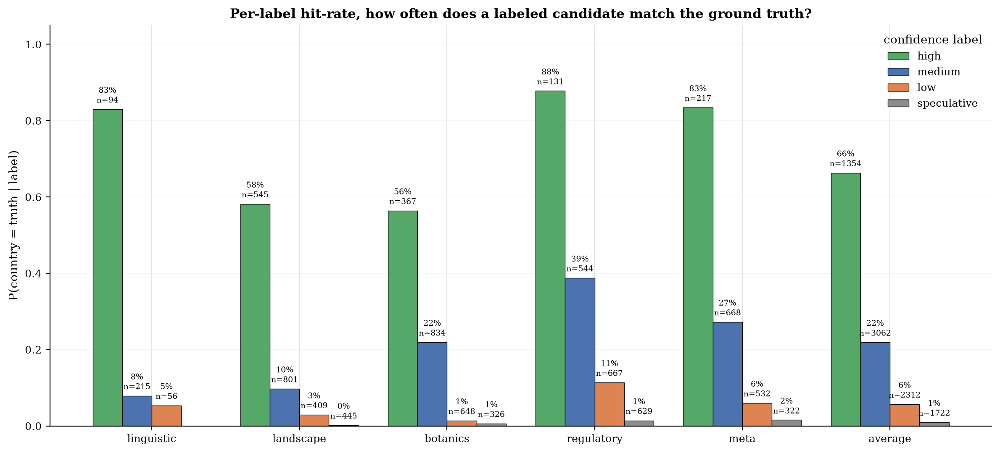

_Figure 7: Per-label hit-rate: how often a labeled candidate equals the ground truth. A well-calibrated agent shows monotonically falling bars (high > medium > low > speculative)._

#### Top-1 Brier / ECE

Single-number summary of how well the **top-1 pick's** confidence label correlates with being correct. Brier = mean squared error of `p` (mapped via `{'high': 0.9, 'medium': 0.6, 'low': 0.3, 'speculative': 0.1}`) against the 0/1 outcome; ECE = expected calibration error across confidence bins. Lower is better for both.

| Agent | n | Brier | ECE |
|---|---|---|---|
| linguistic | 107 | 0.136 | 0.053 |
| landscape | 500 | 0.218 | 0.175 |
| botanics | 500 | 0.221 | 0.107 |
| regulatory | 500 | 0.197 | 0.038 |
| meta | 500 | 0.209 | 0.098 |
| **average** | **2107** | **0.207** | **0.090** |

## 2. Approach Dynamics

The tournament only pipeline runs five independent agent assessments into a candidate pool, seeds the top four of that pool into a bracket (seed 0 vs seed 3, seed 1 vs seed 2, then a final), and returns the champion as the answer. There is no region gate, so these dynamics cover the candidate pool, the pool to bracket seeding step, the bracket matches and the ground truth survival ladder.

### Candidate pool to bracket seeding

| Metric | Value |
|---|---|
| Mean pool size | 5.75 |
| Median pool size | 6 |
| Max pool size | 6 |
| Mean bracket size | 4.00 |
| Mean pool to bracket slack | 1.75 (max 2) |
| Bracket equals pool top 4 (as a set) | 204 (40.8%) |
| Pool larger than 4 (some pool entries dropped) | 485 (97.0%) |

### Seed 0 origin (which signal produces the top seed)

Across 500 images with a bracket, the seed 0 country matches the initial plurality (at least 2 of 5 agents) **93.4%** of the time (n=467).

| Agent | Seed 0 matches this agent top pick |
|---|---|
| linguistic | 95 (19.0%) |
| landscape | 460 (92.0%) |
| botanics | 442 (88.4%) |
| regulatory | 432 (86.4%) |
| meta | 416 (83.2%) |

### Tournament matches

Across 1500 bracket matches: judge agrees with the specialists **97.9%** (n=1469), disagrees **2.1%** (n=31), and a lower seed wins (upset) **5.5%** (n=82).

**Champion by original seed** (500 finals):

| Original seed | Champions | Share |
|---|---|---|
| 0 | 492 | 98.4% |
| 1 | 4 | 0.8% |
| 2 | 4 | 0.8% |

### Initial plurality vs champion (ratify or revise)

Of 498 images with an initial plurality (at least 2 of 5 agents naming the same country), the tournament champion equals that plurality **93.0%** (n=463) and revises it **7.0%** (n=35). 2 images had no initial plurality.

### Ground truth survival ladder

Each gate can drop the ground truth country, and no downstream gate can recover it. Rates are over 500 images with ground truth.

| Gate | Survived | Rate |
|---|---|---|
| Ground truth in candidate pool | 429 | 85.8% |
| Ground truth in bracket (top 4 seeded) | 418 | 83.6% |
| Ground truth at seed 0 | 336 | 67.2% |
| Ground truth reached the final | 384 | 76.8% |
| Ground truth won the tournament | 339 | 67.8% |

**Gate to gate survival of ground truth:**

- In pool to in bracket: 97.4%
- In bracket to reached final: 91.9%
- Reached final to won tournament: 88.3%

### Seed fidelity (does the tournament correct mis seedings?)

Over the 418 images where the ground truth reached the bracket, the tournament picks it **81.1%** of the time (n=339).

| Ground truth seed | n | Won | Win rate |
|---|---|---|---|
| 0 | 336 | 334 | 99.4% |
| 1 | 40 | 1 | 2.5% |
| 2 | 27 | 4 | 14.8% |
| 3 | 15 | 0 | 0.0% |

### Per-agent initial round

In tournament only there is no per-agent country reassessment, so each agent contributes only its initial top pick.

| Agent | n | Top-1 | Top-3 | Coverage |
|---|---|---|---|---|
| linguistic | 107 | 78.5% | 86.0% | 91.6% |
| landscape | 500 | 64.8% | 79.6% | 81.4% |
| botanics | 500 | 63.4% | 78.4% | 80.0% |
| regulatory | 500 | 64.8% | 79.4% | 82.0% |
| meta | 500 | 62.6% | 78.2% | 79.8% |

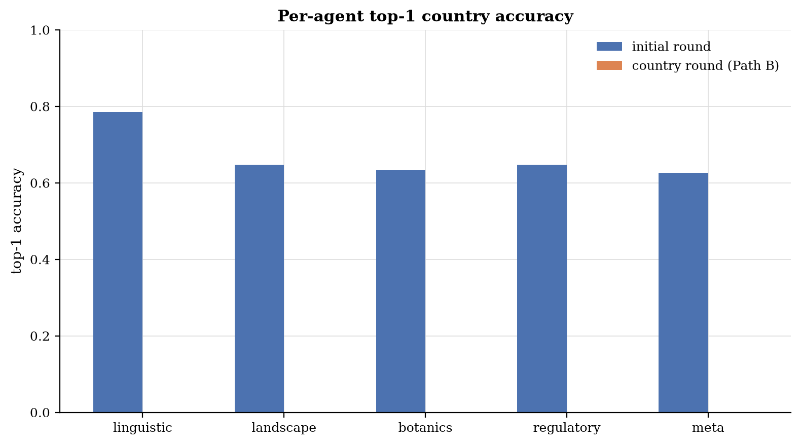

_Figure 8: Per-agent top-1 accuracy._

## 3. LLM-as-Judge Verdicts

- Verdicts: 500/500
- Constructive synthesis rate: 93.2% (n=500)

### Per-agent quantitative scores

| Agent | n | Role adher. | Hallucination ↓ | Visual cons. ↑ | Calibration ↑ |
|---|---|---|---|---|---|
| linguistic | 107 | 100.0% | 0.01 | 0.53 | 0.34 |
| landscape | 500 | 100.0% | 0.01 | 0.91 | 0.69 |
| botanics | 500 | 100.0% | 0.02 | 0.90 | 0.65 |
| regulatory | 500 | 100.0% | 0.01 | 0.90 | 0.63 |
| meta | 500 | 100.0% | 0.06 | 0.86 | 0.66 |

_Figure 9: Per-agent role adherence rate (overall, when run correct, when run wrong)._

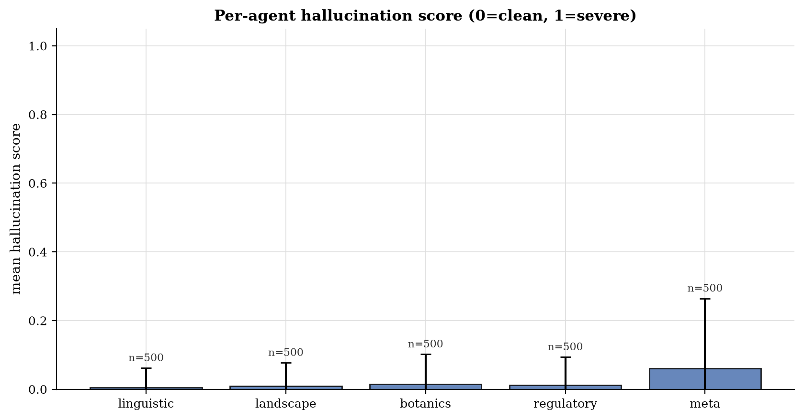

_Figure 10: Per-agent mean hallucination score (0 = clean, 1 = severe)._

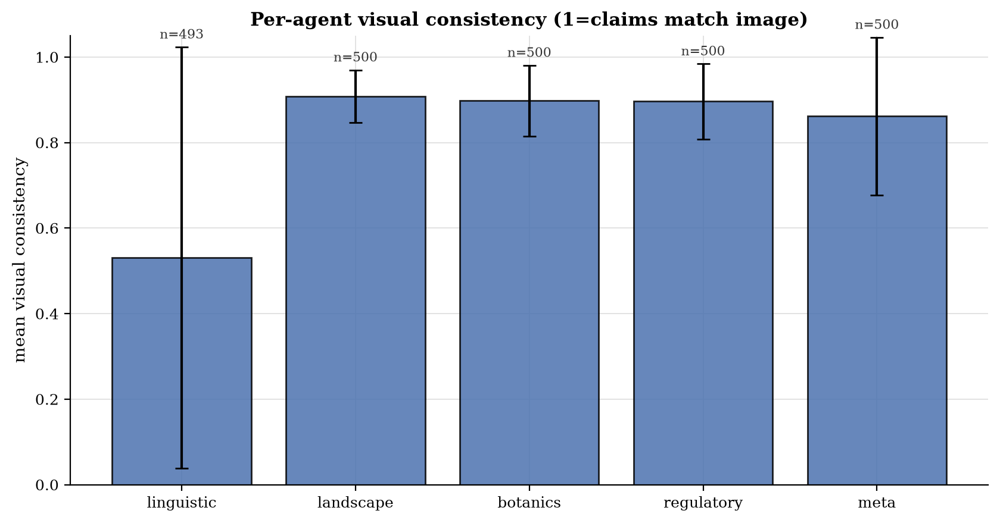

_Figure 11: Per-agent mean visual consistency._

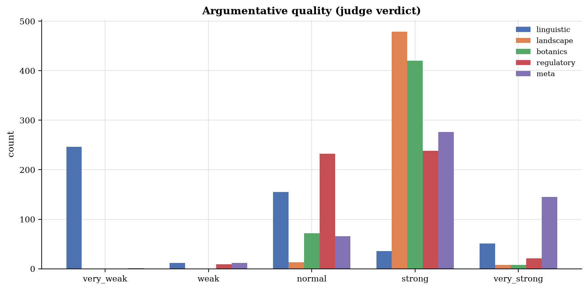

_Figure 12: Argumentative quality histogram per agent._

### Tournament failure attribution

For matches where the truth was in the candidate pool but did not win, the judge classifies the cause. Counterfactual winnable rate: **19.2%** (193 attributable losses).

| Failure reason | Count |
|---|---|
| `not_applicable` | 307 |
| `agent_misled_pre_pool` | 102 |
| `agent_misled_in_tournament` | 41 |
| `judge_misjudgment` | 34 |
| `ambiguous_evidence` | 15 |
| `missing_rag_refs` | 1 |

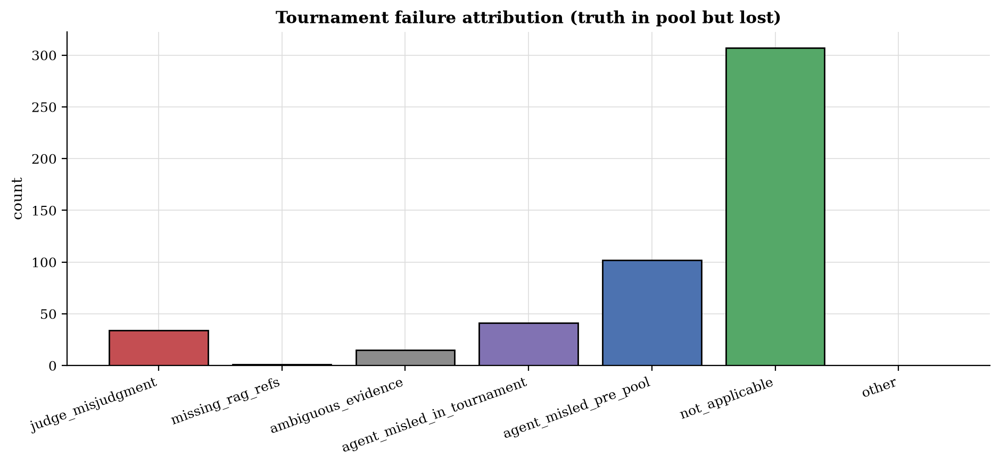

_Figure 13: Tournament failure attribution histogram._

#### Failure examples (first 10)

| Image | Reason | Lost to | Round | Counterfactual? |
|---|---|---|---|---|
| 1NJsXTxIF9GGMDxC_1 | `agent_misled_in_tournament` | Kazakhstan | semi-2 | no |
| 1NJsXTxIF9GGMDxC_3 | `ambiguous_evidence` | Bosnia and Herzegovina | final | no |
| 3I4ZtihbhZy5qZzQ_1 | `judge_misjudgment` | India | final | yes |
| 3I4ZtihbhZy5qZzQ_2 | `agent_misled_pre_pool` | ,  | ,  | no |
| 3I4ZtihbhZy5qZzQ_4 | `agent_misled_pre_pool` | ,  | ,  | no |
| 3I4ZtihbhZy5qZzQ_5 | `judge_misjudgment` | Ecuador | semi-2 | yes |
| 3OuVMcpGjmm0tVfG_1 | `judge_misjudgment` | Philippines | final | yes |
| 3OuVMcpGjmm0tVfG_5 | `agent_misled_pre_pool` | ,  | ,  | no |
| 3uP6lYo9pzx5Q0km_2 | `ambiguous_evidence` | Sweden | final | no |
| 3uP6lYo9pzx5Q0km_3 | `judge_misjudgment` | Czech Republic | final | yes |

### Hallucination examples

Concrete claims the judge flagged as not supported by the image. Up to 5 examples per agent.

#### linguistic

| Image | Score | Hallucinated claim |
|---|---|---|
| HF1MKwIFNCNb4FdM_3 | 0.75 | The text 'Vilabonita' on the billboard is a specific residential project name common in Colombia. |
| HLDekf7z49ovS9Y8_1 | 0.50 | The graffiti 'PIRAI CAMEO' contains words consistent with Portuguese. |
| oIqmyQzBGtaIeI84_4 | 0.75 | The text 'SOLGAS' refers to a gas distribution company that operates primarily in Colombia. |
| z2mhsiTu4DYWixQf_5 | 0.50 | The sign on the left contains the word 'سورية' (Syria/Syrian) |

#### landscape

| Image | Score | Hallucinated claim |
|---|---|---|
| 74bPHM081cMUaNKT_4 | 0.75 | The landscape specialist claims 'light-colored, weathered sedimentary rock cuts on the right' are 'highly characteristic of the Colombian interior' and 'specific weathered sedimentary rock cuts'. The image shows a generic dirt/gravel embankment with some exposed subsoil, not distinct sedimentary rock cuts. |
| 74bPHM081cMUaNKT_4 | 0.75 | The landscape specialist claims the 'specific road marking style... is very common in the Colombian highlands'. The yellow center line is a generic international standard, not specific to Colombia. |
| 9lNwy1vjD53PTSwt_2 | 0.20 | claimed 'specific species of deciduous trees' — the prominent trees are clearly Eucalyptus (evergreen), not deciduous. |
| HLDekf7z49ovS9Y8_1 | 0.50 | The combination of reddish-brown sandy soil... is highly characteristic of Brazil. |
| KWr0ySMIaUQRvikA_3 | 0.75 | landscape agent: 'The combination of sandy red-brown soil and dense, low-lying scrubby green vegetation is highly characteristic of the Sahelian transition zone.' (The image shows a Chaco landscape, not the Sahel; the agents hallucinated the Sahel context.) |

#### botanics

| Image | Score | Hallucinated claim |
|---|---|---|
| 4UvmdTHySo6AXW4M_4 | 0.50 | claimed 'Saguaro' is a common North American desert indicator (it is not native to the region shown) |
| 4UvmdTHySo6AXW4M_4 | 0.50 | claimed 'Creosote bush' is a distinct visual indicator present/absent in the scrub |
| 6ypQOh9cOoE7WaWH_3 | 0.20 | claimed 'eucalyptus globulus (introduced)' visible in background — image shows generic montane forest/scrub, no distinct eucalyptus trees visible |
| 74bPHM081cMUaNKT_4 | 0.25 | The botanics agent claims 'Acacia-like trees' are visible. The trees in the image are generic broadleaf/scrub; identifying them as Acacia is a weak inference, though not a total fabrication. |
| 9lNwy1vjD53PTSwt_2 | 0.20 | claimed 'Platanus orientalis (Oriental Plane)' — the trees visible are Eucalyptus (tall, smooth bark, drooping leaves), not Plane trees. |

#### regulatory

| Image | Score | Hallucinated claim |
|---|---|---|
| HF1MKwIFNCNb4FdM_3 | 0.50 | The billboard text 'Vilabonita' and the general style of the utility poles and street lighting are consistent with Colombian infrastructure. |
| HLDekf7z49ovS9Y8_1 | 0.50 | The combination of unpaved dirt roads... is very common in Brazilian outskirts. |
| JnTw9kl2nWPFaoUg_5 | 0.50 | claimed 'white Toyota Hiace commuter vans with specific colorful decals... are extremely characteristic of Ugandan matatus' (decals are actually a Kenyan hallmark; Uganda uses plain or differently marked vans). |
| KWr0ySMIaUQRvikA_3 | 0.50 | regulatory agent: 'The combination of narrow asphalt, sandy shoulders, and specific wooden utility pole cross-arm style is common in rural Botswana.' (Speculative hallucination of infrastructure style.) |
| QTmrnxW99iiyS2xS_3 | 0.50 | The double yellow center lines are a quintessential road marking for the USA, whereas Turkey typically uses white lines for road separation. |

#### meta

| Image | Score | Hallucinated claim |
|---|---|---|
| 4UvmdTHySo6AXW4M_4 | 0.75 | claimed 'concrete poles with a specific tapered design' are visible (poles are clearly wooden) |
| 4UvmdTHySo6AXW4M_4 | 0.75 | claimed 'concrete poles' are standard in South Africa (they are wooden in the image) |
| 56Q4T4rpv9O9sCpP_2 | 0.75 | The utility pole is a classic South African design: a concrete pole with a specific T-shaped cross-arm and insulator configuration common in rural areas. |
| 56Q4T4rpv9O9sCpP_5 | 1.00 | The image shows a very distinct Google Street View camera artifact: the 'halo' or blur at the bottom of the frame is characteristic of the camera rig used in Botswana's coverage. |
| 56Q4T4rpv9O9sCpP_5 | 1.00 | the specific camera blur at the bottom is less common for the standard South African coverage compared to Botswana. |
